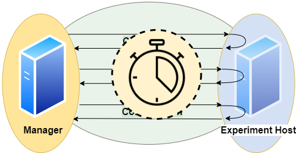
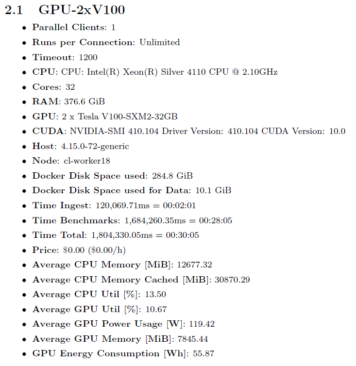
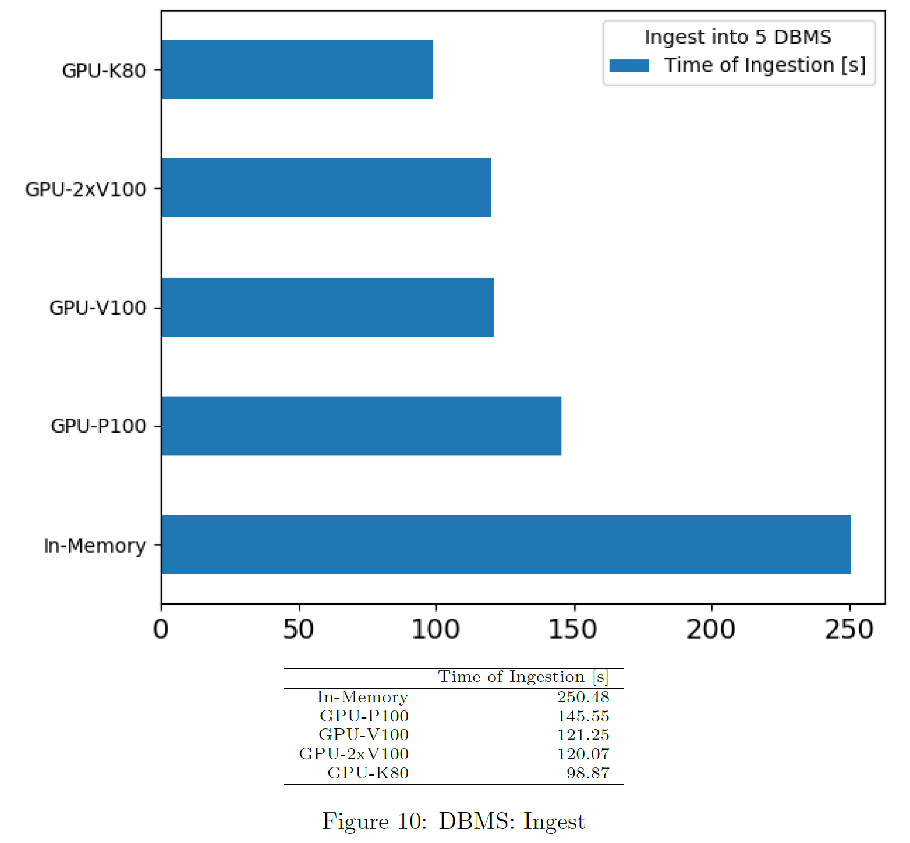
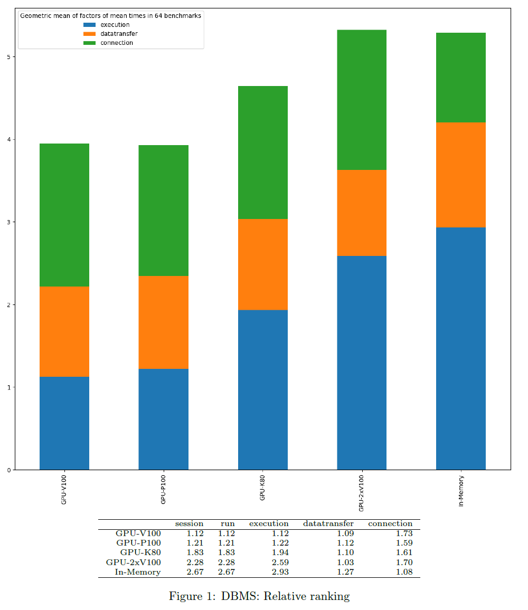
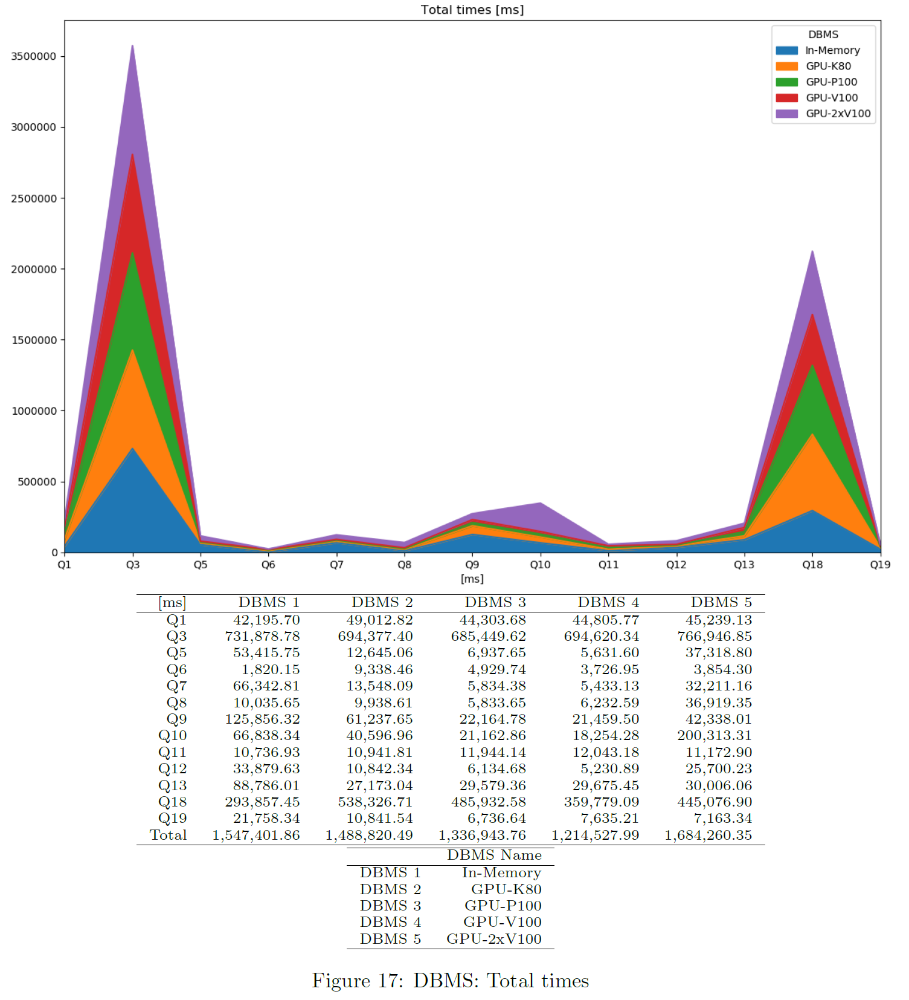
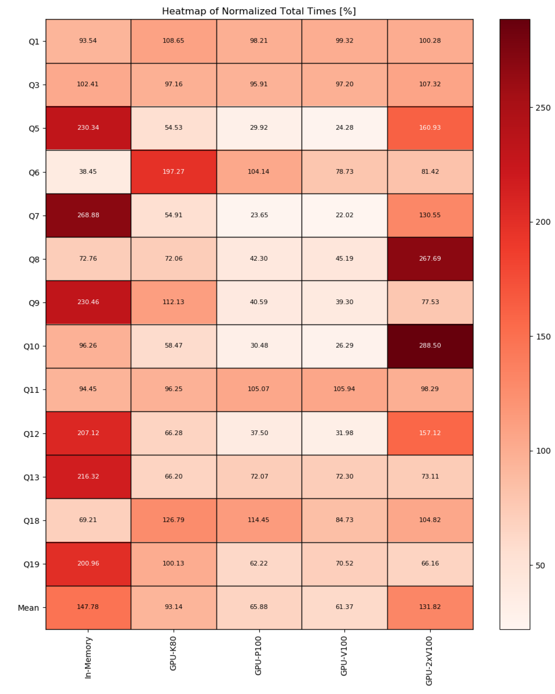
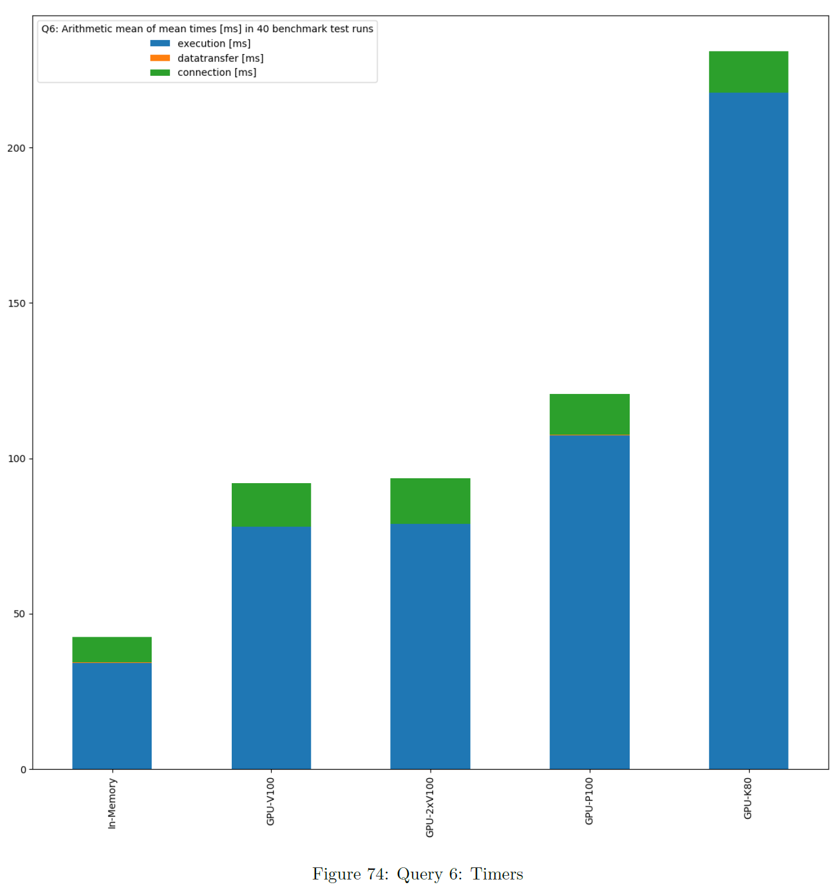
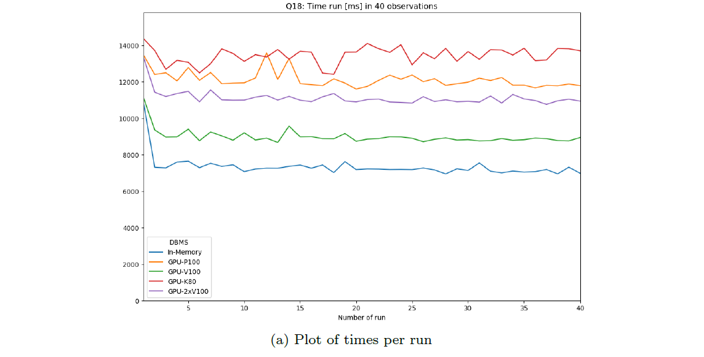
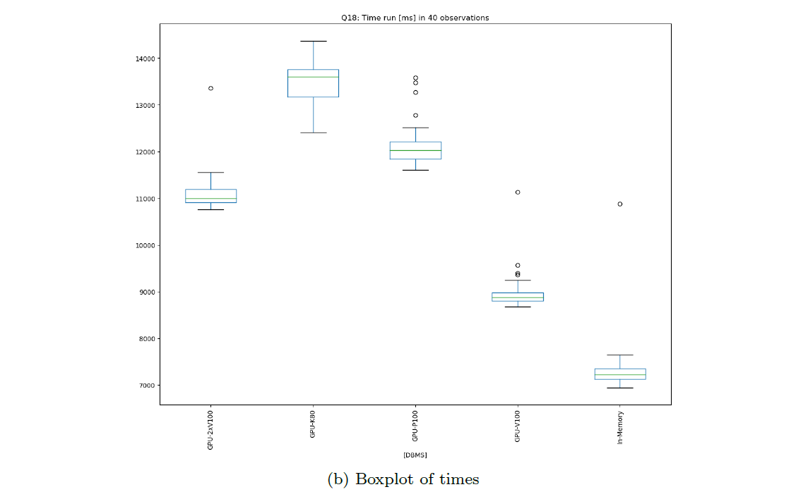

# DBMS-Benchmarker

DBMS-Benchmarker is a Python-based application-level blackbox benchmark tool for Database Management Systems (DBMS).
It aims at reproducible measuring and easy evaluation of the performance the user receives even in complex benchmark situations.
It connects to a given list of DBMS (via JDBC) and runs a given list of (SQL) benchmark queries.
Queries can be parametrized and randomized.
Results and evaluations are available via a Python interface.
Optionally some reports are generated.
An interactive dashboard assists in multi-dimensional analysis of the results.

## Key Features

DBMS-Benchmarker
* is Python3-based
* connects to all [DBMS](#connection-file) having a JDBC interface - including GPU-enhanced DBMS
* requires *only* JDBC - no vendor specific supplements are used
* benchmarks arbitrary SQL queries - in all dialects
* allows [planning](#query-file) of complex test scenarios - to simulate realistic or revealing use cases
* allows easy repetition of benchmarks in varying settings - different hardware, DBMS, DBMS configurations, DB settings etc
* investigates a number of timing aspects - connection, execution, data transfer, in total, per session etc
* investigates a number of other aspects - received result sets, precision, number of clients
* collects hardware metrics from a Grafana server - hardware utilization, energy consumption etc
* helps to [evaluate](#evaluation) results - by providing  
  * standard Python data structures
  * predefined evaluations like statistics, plots, Latex reporting
  * an [inspection tool](#inspector)
  * an [interactive dashboard](#dashboard)

**TODO: Multi-dimensional**

For more informations, see a [basic example](#basic-usage), take a look at help for a full list of [options](#command-line-options-and-configuration) or take a look at a [demo report](docs/Report-example-tpch.pdf).

The code uses several Python modules, in particular <a href="https://github.com/baztian/jaydebeapi" target="_blank">jaydebeapi</a> for handling DBMS.
This module has been tested with Brytlyt, Exasol, Kinetica, MariaDB, MemSQL, Mariadb, MonetDB, OmniSci and PostgreSQL.

### Overview

This documentation contains
* an example of the [basic usage](#basic-usage) in Python
* an illustration of the [concepts](#concepts)
* an illustration of the [evaluations](#statistics-and-metrics)
* a description of the [options and configurations](#parameters)
* more extensive examples of using the [cli tool](#usage)
* some [use-cases](#use-cases) and [test scenarios](#scenarios)
* examples of how to use the interactive [inspector](#inspector)

#### Limitations

Limitations are:
* strict black box perspective - may not use all tricks available for a DBMS
* strict JDBC perspective - depends on a JVM and provided drivers
* strict user perspective - client system, network connection and other host workloads may affect performance
* not officially applicable for well known benchmark standards - partially, but not fully complying with TPC-H and TPC-DS
* hardware metrics are collected from a monitoring system - not as precise as profiling
* no GUI for configuration
* strictly Python - a very good and widely used language, but maybe not your choice

Other comparable products you might like
* [Apache JMeter](https://jmeter.apache.org/index.html) - Java-based performance measure tool, including a configuration GUI and reporting to HTML
* [HammerDB](https://www.hammerdb.com/) - industry accepted benchmark tool, but limited to some DBMS
* [Sysbench](https://github.com/akopytov/sysbench) - a scriptable multi-threaded benchmark tool based on LuaJIT
* [OLTPBench](https://github.com/oltpbenchmark/oltpbench) -Java-based performance measure tool, using JDBC and including a lot of predefined benchmarks 

## Basic Usage

The following very simple use case runs the query `SELECT COUNT(*) FROM test` 10 times against one local MySQL installation.
As a result we obtain the execution times as a csv file, as a series plot and as a bloxplot.

We need to provide
* a [DBMS configuration file](#connection-file), e.g. in `./config/connections.config`  
```
[
  {
    'name': "MySQL",
    'active': True,
    'JDBC': {
      'driver': "com.mysql.cj.jdbc.Driver",
      'url': "jdbc:mysql://localhost:3306/database",
      'auth': ["username", "password"],
      'jar': "mysql-connector-java-8.0.13.jar"
    }
  }
]
```
* a [Queries configuration file](#query-file), e.g. in `./config/queries.config`  
```
{
  'name': 'Some simple queries',
  'queries':
  [
    {
      'title': "Count all rows in test",
      'query': "SELECT COUNT(*) FROM test",
      'numRun': 10
    }
  ]
}
```

In Python we basically use the benchmarker as follows:
```
from dbmsbenchmarker import *

# tell the benchmarker where to find the config files
configfolder = "./config"
# tell the benchmarker where to put results
resultfolder = "/results"

# get a benchmarker object
dbms = benchmarker.benchmarker(result_path=resultfolder)
dbms.getConfig(configfolder)

# tell the benchmarker which evaluations we want to have
dbms.reporter.append(benchmarker.reporter.ploter(dbms))
dbms.reporter.append(benchmarker.reporter.boxploter(dbms))

# start benchmarking
dbms.runBenchmarks()

# print collected errors
dbms.printErrors()

# get evaluation dict
e = evaluator.evaluator(benchmarks)
# show it
e.pretty()
# show part about query 1
e.pretty(e.evaluation['query'][1])
# get dataframe of benchmarks for query 1 and timerRun
dfb1 = benchmarks.benchmarksToDataFrame(1,benchmarks.timerRun)
# get dataframe of statistics for query 1 and timerRun
dfs1 = benchmarks.statsToDataFrame(1,benchmarks.timerRun)
```
There also is a [command line interface](#command-line-options-and-configuration) for running benchmarks and generation of reports.

**TODO: New inspection**


## Concepts

### Experiment

An **experiment** is organized in *queries*.
A **query** is a statement, that is understood by a Database Management System (DBMS).

### Single Query

A **benchmark** of a query consists of these steps:
<p align="center">

</p>

1. Establish a **connection** between client and server  
This uses `jaydebeapi.connect()` (and also creates a cursor - time not measured)
1. Send the query from client to server and
1. **Execute** the query on server  
These two steps use `execute()` on a cursor of the JDBC connection
1. **Transfer** the result back to client  
This uses `fetchall()` on a cursor of the JDBC connection
1. Close the connection  
This uses `close()` on the cursor and the connection

The times needed for steps connection (1.), execution (2. and 3.) and transfer (4.) are measured on the client side.
A unit of connect, send, execute and transfer is called a **run**. Connection time will be zero if an existing connection is reused.
A sequence of runs between establishing and discarding a connection is called a **session**.

### Basic Parameters

A basic parameter of a query is the **number of runs** (units of send, execute, transfer).
To configure sessions it is also possible to adjust
* the **number of runs per connection** (session length, to have several sequential connections) and  
* the **number of parallel connections** (to simulate several simultanious clients)
* a **timeout** (maximum lifespan of a connection)
* a **delay** for throttling (waiting time before each connection or execution)

for the same query.

<p align="center">

</p>

Parallel clients are simulated using the `pool.apply_async()` method of a `Pool` object of the module [multiprocessing](https://docs.python.org/3/library/multiprocessing.html).
Runs and their benchmark times are ordered by numbering.

We can specify a **number of warmup runs** and a **number of cooldown runs**.
This means the first n runs resp. the last n runs are ignored in evaluation.
**Note** this is only reliable for non-parallel connections.

Moreover we can **randomize** a query, such that each run will look slightly different.
This means we exchange a part of the query for a random value.

### Basic Metrics

We have several **timers** to collect timing information:

<p align="center">

</p>

* **timerConnection**  
This timer gives the time in ms and per run.  
It measures the time it takes to establish a JDBC connection.  
**Note** that if a run reuses an established connection, this timer will be 0 for that run.
* **timerExecution**  
This timer gives the time in ms and per run.  
It measures the time between sending a SQL command and receiving a result code via JDBC.
* **timerTransfer**  
This timer gives the time in ms and per run.  
**Note** that if a run does not transfer any result set (a writing query or if we suspend the result set), this timer will be 0 for that run.
* **timerRun**  
This timer gives the time in ms and per run.  
That is the sum of *timerConnection*, *timerExecution* and *timerTransfer*.  
**Note** that connection time is 0, if we reuse an established session, and transfer time is 0, if we do not transfer any result set.
* **timerSession**  
This timer gives the time in ms and per session.  
It aggregates all runs of a session and sums up their *timerRun*s.  
A session starts with establishing a connection and ends when the connection is disconnected.  
This timer ignores warmup / cooldown phases, since they are only valid for runs.

The benchmark times of a query are stored in csv files (optional pickeled pandas dataframe): For connection, execution and transfer.
The columns represent DBMS and each row contains a run.

We also measure and store the **total time** of the benchmark of the query, since for parallel execution this differs from the **sum of times** based on *timerRun*. Total time means measurement starts before first benchmark run and stops after the last benchmark run has been finished. Thus total time also includes some overhead (for spawning a pool of subprocesses, compute size of result sets and joining results of subprocesses). Additionally total time always spans all benchmarks. The sum of times on the other hand ignores warmup and cooldown phase.

We think
* the sum of times is more of an indicator for performance of the server system
* the total time is more of an indicator for the performance the client user receives.

We also compute for each query and DBMS
* **Latency**: Mean time (without warmup / cooldown)
* **Throughput**:
  * Number of runs per total time (including warmup / cooldown phase)
  * Number of parallel clients per mean time (without warmup / cooldown)

In the end we have
* Per DBMS: Total time of experiment
* Per DBMS and Query:
  * Time per session
  * Time per run
  * Time per run, split up in: connection / execution / data transfer
  * Latency and Throughputs per run
  * Latency and Throughputs per session

Additionally error messages and timestamps of begin and end of benchmarking a query are stored.


### Comparison

We can specify a dict of DBMS.
Each query will be sent to every DBMS in the same number of runs.

<p align="center">

</p>

This also respects randomization, i.e. every DBMS receives exactly the same versions of the query in the same order.

We assume all DBMS will give us the same result sets.
Without randomization, each run should yield the same result set.
This tool automatically can check these assumptions by **comparison**.
The resulting data table is handled as a list of lists and treated by this:
```
# restrict precision
data = [[round(float(item), int(query.restrict_precision)) if tools.convertToFloat(item) == float else item for item in sublist] for sublist in data]
# sort by all columns
data = sorted(data, key=itemgetter(*list(range(0,len(data[0])))))
# size of result
size = int(df.memory_usage(index=True).sum())
# hash of result
columnnames = [[i[0].upper() for i in connection.cursor.description]]
hashed = columnnames + [[hashlib.sha224(pickle.dumps(data)).hexdigest()]]
```
Result sets of different runs (not randomized) and different DBMS can be compared by their sorted table (small data sets) or their hash value or size (bigger data sets).

In order to do so, result sets (or their hash value or size) are stored as lists of lists and additionally can be saved as csv files or pickled pandas dataframes.

### Monitoring Hardware Metrics

To make these metrics available, we must [provide](#connection-file) an API URL and an API Access Token for a Grafana Server.
The tool collects metrics from the Grafana server with a step size of 1 second.
The requested interval matches the interval a specific DBMS is queried.
To increase expressiveness, it is possible to extend the scraping interval by n seconds at both ends.
In the end we have a list of per second values for each query and DBMS.
We may define the metrics in terms of promql.
Metrics can be defined per connection.

Example:
```
'title': 'CPU Memory [MB]'
'query': 'container_memory_working_set_bytes{container_label_io_kubernetes_container_name="dbms"}'

'title': 'CPU Memory Cached [MB]'
'query': 'container_memory_usage_bytes{container_label_io_kubernetes_container_name="dbms"}'

'title': 'CPU Util [%]'
'query': 'sum(irate(container_cpu_usage_seconds_total{container_label_io_kubernetes_container_name="dbms"}[1m]))'

'title': 'CPU Throttle [%]'
'query': 'sum(irate(container_cpu_cfs_throttled_seconds_total{container_label_io_kubernetes_container_name="dbms"}[1m]))'

'title': 'CPU Util Others [%]'
'query': 'sum(irate(container_cpu_usage_seconds_total{container_label_io_kubernetes_container_name!="dbms",id!="/"}[1m]))'

'title': 'Net Rx [b]'}, 'total_network_tx'
'query': 'sum(container_network_receive_bytes_total{container_label_app="dbmsbenchmarker"})'

'title': 'Net Tx [b]'
'query': 'sum(container_network_transmit_bytes_total{container_label_app="dbmsbenchmarker"})'

'title': 'FS Read [b]'
'query': 'sum(container_fs_reads_bytes_total{container_label_io_kubernetes_container_name="dbms"})'

'title': 'FS Write [b]'
'query': 'sum(container_fs_writes_bytes_total{container_label_io_kubernetes_container_name="dbms"})'

'title': 'GPU Util [%]'
'query': 'DCGM_FI_DEV_GPU_UTIL{UUID=~"GPU-4d1c2617-649d-40f1-9430-2c9ab3297b79"}'

'title': 'GPU Power Usage [W]'
'query': 'DCGM_FI_DEV_POWER_USAGE{UUID=~"GPU-4d1c2617-"}'

'title': 'GPU Memory [MiB]'
'query': 'DCGM_FI_DEV_FB_USED{UUID=~"GPU-4d1c2617-"}'
```

**Note** this expects monitoring to be installed properly and naming to be appropriate. See https://github.com/Beuth-Erdelt/Benchmark-Experiment-Host-Manager for a working example and more details.

**Note** this has limited validity, since metrics are typically scraped only on a basis of several seconds. It works best with a high repetition of the same query.

### Evaluation

**TODO: Multi-Dimensional**
As a result we obtain measured times in milliseconds for the query processing parts: connection, execution, data transfer.
These are described in three dimensions:
number of run, number of query and number of configuration.
The configurations can consist of various parameters like DBMS, selected processor, assigned cluster node, number of clients and execution order.
We also can have various hardware metrics like CPU and GPU utilization, CPU throttling, memory caching and working set.
These are also described in three dimensions:
Second of query execution time, number of query and number of configuration.
All these metrics can be sliced or diced, rolled-up or drilled-down into the various dimensions using several aggregation functions.

#### Statistical Measures

Currently the following statistics are computed:
* Sensitive to outliers
  * Arithmetic mean
  * Standard deviation
  * Coefficient of variation
* Insensitive to outliers
  * Median
  * Interquartile range
  * Quartile coefficient of dispersion


# Evaluation

After an experiment has finished, the results can be evaluated
* with an interactive [dashboard](#dashboard)
* in a Latex report containing most of the results
* with an interactive [inspection module](#inspector)

There is an *evaluator class*, which collects most of the (numerical) evaluations and provides them as an **evaluation dict**.

## Featured Evaluations

Predefined evaluations are
* [Global Metrics](#global-metrics)
  * [average position](#average-ranking)
  * [latency and throughput](#latency-and-throughput)
  * [ingestion](#time-of-ingest-per-dbms)
  * [hardware metrics](#hardware-metrics)
  * [host metrics](#host-metrics)
* [Drill-Down Timers](#drill-down-timers)
  * [relative position](#relative-ranking-based-on-times)
  * [average times](#average-times)
* [Slices of Timers](#slice-timers)
  * [heatmap of factors](#heatmap-of-factors)
* [Drill-Down Queries](#drill-down-queries)
  * [total times](#total-times)
  * [normalized total times](#normalized-total-times)
  * [latencies](#latencies)
  * [throughputs](#throughputs)
  * [sizes of result sets](#sizes-of-result-sets)
  * [errors](#errors)
  * [warnings](#warnings)
* [Slices of Queries](#slice-queries)
  * [latency and throughput](#latency-and-throughput-per-query)
  * [hardware metrics](#hardware-metrics-per-query)
  * [timers](#timers-per-query)
* [Slices of Queries and Timers](#slice-queries-and-timers)
  * [statistics](#statistics-table) - measures of tendency and dispersion, sensitive and insensitive to outliers
  * [plots](#plot-of-values) of times
  * [box plots](#boxplot-of-values) of times
  * [bar plots](#bar-chart-per-query) of times
* summarizing and exhaustive latex reports containing [further data](#further-data) like
  * precision and identity checks of [result sets](#comparison)
  * [error messages](#all-errors)
  * [warnings](#all-warnings)
  * [benchmark times](#all-benchmark-times)
  * [experiment workflow](#bexhoma-workflow)
  * [initialization scripts](#initialization-scripts)
* an interactive [inspection tool](#inspector)
* a Latex report containing most of these

### Informations about DBMS
This evaluation is available in the evaluation dict and in the latex reports.

<p align="center">

</p>

The user has to provide in a [config file](#connection-file)
* a unique name (**connectionname**)
* JDBC connection information

If a monitoring interface is provided, [hardware metrics](#hardware-metrics) are collected and aggregated.
We may further provide describing information for reporting.

#### Throughput and Latency

The abbreviations mean
```
lat_r = Latency of runs (mean time) [ms]
lat_s = Latency of session (mean time) [ms]
tps_r1 = Throughput of runs (number of runs / total time) [Hz]
tps_r2 = Throughput of runs (number of parallel clients / cleaned mean time) [Hz]
tps_s1 = Throughput of sessions (number of runs / length of sessions / total time) [Hz]
tps_s2 = Throughput of sessions (number of parallel clients / cleaned mean time) [Hz]
tph_r2 = Throughput of runs (tps_r2 * 3600) [pH]
```

The metrics of index 2 are based on the assumption that the number of clients equals the size of the queues. To check this, there are another metrics:
```
qs_r = Queue size of runs (tps_r1 * lat_r * 1000)
qs_s = Queue size of sessions (tps_s1 * lat_s * 1000)
```

**Note** that the total times include some overhead like spawning a pool of subprocesses, so these metrics are also a measurement of overhead.


### Global Metrics

#### Latency and Throughput
This evaluation is available as dataframes, in the evaluation dict and as png files.

<p align="center">

</p>

For each query, latency and throughput is computed per DBMS.
This chart shows the geometric mean over all queries and per DBMS.
Only successful queries and DBMS not producing any error are considered there.

#### Average Ranking
This evaluation is available as dataframes, in the evaluation dict and as png files.

<p align="center">

</p>

We compute a ranking of DBMS for each query based on the sum of times, from fastest to slowest.
Unsuccessful DBMS are considered last place.
The chart shows the average ranking per DBMS.

#### Time of Ingest per DBMS
This evaluation is available as dataframes, in the evaluation dict and as png files.

<p align="center">

</p>

This is part of the informations provided by the user.
The tool does not measure time of ingest explicitly.

#### Hardware Metrics

The chart shows the metrics obtained from monitoring.
Values are computed as arithmetic mean across benchmarking time.
Only successful queries and DBMS not producing any error are considered.

<p align="center">

</p>

#### Host Metrics

The chart shows the metrics obtained from inside docker containers.
The host information is provided in the [config file](#connection-file).
Here, cost is based on the total time.

<p align="center">

</p>

### Drill-Down Timers

#### Relative Ranking based on Times
This evaluation is available as dataframes, in the evaluation dict and as png files.

<p align="center">

</p>

For each query and timer, the best DBMS is considered as gold standard = 100%. Based on their times, the other DBMS obtain a relative ranking factor.
Only successful queries and DBMS not producing any error are considered.
The chart shows the geometric mean of factors per DBMS.

#### Average Times
This evaluation is available as dataframes, in the evaluation dict and as png files.

<p align="center">

</p>

This is based on the mean times of all benchmark test runs.
Measurements start before each benchmark run and stop after the same benchmark run has been finished. The average value is computed per query.
Parallel benchmark runs should not slow down in an ideal situation.
Only successful queries and DBMS not producing any error are considered.
The chart shows the average of query times based on mean values per DBMS and per timer.

**Note** that the mean of mean values (here) is in general not the same as mean of all runs (different queries may have different number of runs).

### Slice Timers

#### Heatmap of Factors
This evaluation is available as dataframes, in the evaluation dict and as png files.

<p align="center">

</p>

The relative ranking can be refined to see the contribution of each query.
The chart shows the factor of the corresponding timer per query and DBMS.
All active queries and DBMS are considered.


### Drill-Down Queries

#### Total Times
This evaluation is available as dataframes, in the evaluation dict and as png files.

<p align="center">

</p>

This is based on the times each DBMS is queried in total. Measurement starts before first benchmark run and stops after the last benchmark run has been finished. Parallel benchmarks should speed up the total time in an ideal situation.
Only successful queries and DBMS not producing any error are considered.
Note this also includes the time needed for sorting and storing result sets etc.
The chart shows the total query time per DBMS and query.

#### Normalized Total Times
This evaluation is available in the evaluation dict and as png files.

<p align="center">

</p>

The chart shows total times per query, normalized to the average total time of that query.
Only successful queries and DBMS not producing any error are considered.
This is also available as a heatmap.

<p align="center">

</p>

#### Throughputs

This evaluation is available in the evaluation dict and as png files.

<p align="center">

</p>

For each query, latency and throughput is computed per DBMS.
The chart shows tps_r2.
Only successful queries and DBMS not producing any error are considered there.

#### Latencies

This evaluation is available in the evaluation dict and as png files.

<p align="center">

</p>

For each query, latency and throughput is computed per DBMS.
The chart shows lat_r.
Only successful queries and DBMS not producing any error are considered there.

#### Sizes of Result Sets

This evaluation is available in the evaluation dict and as png files.

<p align="center">

</p>

For each query, the size of received data per DBMS is stored.
The chart shows the size of result sets per DBMS and per timer.
Sizes are normalized to minimum per query.
All active queries and DBMS are considered.

#### Errors

This evaluation is available in the evaluation dict and as png files.

<p align="center">

</p>

The chart shows per DBMS and per timer, if an error has occured.
All active queries and DBMS are considered.

#### Warnings

This evaluation is available in the evaluation dict and as png files.

<p align="center">

</p>

The chart shows per DBMS and per timer, if a warning has occured.
All active queries and DBMS are considered.

### Slice Queries

#### Latency and Throughput per Query
This evaluation is available as dataframes, in the evaluation dict and as png files.

<p align="center">

</p>

For each query, latency and throughput is computed per DBMS.
This is available as dataframes, in the evaluation dict and as png files per query.
Only successful queries and DBMS not producing any error are considered there.

#### Hardware Metrics per Query
These metrics are available as png files and csv files.

<p align="center">

</p>

These metrics are collected from a Prometheus / Grafana stack.
This expects time-synchronized servers.

#### Timers Per Query
These plots are available as png files.

<p align="center">

</p>

This is based on the sum of times of all single benchmark test runs.
These charts show the average of times per DBMS based on mean value.
Warmup and cooldown are not included.
If data transfer or connection time is also benchmarked, the chart is stacked.
The bars are ordered ascending.

### Slice Queries and Timers

#### Statistics Table
These tables are available as dataframes and in the evaluation dict.

<p align="center">

</p>

These tables show [statistics](#statistics) about benchmarking time during the various runs per DBMS as a table.
Warmup and cooldown are not included.
This is for inspection of stability.
A factor column is included.
This is computed as the multiple of the minimum of the mean of benchmark times per DBMS.
The DBMS are ordered ascending by factor.

#### Plot of Values
These plots are available as png files.

<p align="center">

</p>

These plots show the variation of benchmarking time during the various runs per DBMS as a plot.
Warmup and cooldown are included and marked as such.
This is for inspection of time dependence.

**Note** this is only reliable for non-parallel runs.

#### Boxplot of Values
These plots are available as png files.

<p align="center">

</p>

These plots show the variation of benchmarking time during the various runs per DBMS as a boxplot.
Warmup, cooldown and zero (missing) values are not included.
This is for inspection of variation and outliers.

#### Histogram of Values
These plots are available as png files.

<p align="center">

</p>

These plots show the variation of benchmarking time during the various runs per DBMS as a histogram.
The number of bins equals the minimum number of result times.
Warmup, cooldown and zero (missing) values are not included.
This is for inspection of the distribution of times.

### Further Data

#### Result Sets per Query
This evaluation is available as dataframes and csv files.

The result set (sorted values, hashed or pure size) of the first run of each DBMS can be saved per query.
This is for comparison and inspection. 

#### All Benchmark Times
This evaluation is available as dataframes, in the evaluation dict and as csv files.

The benchmark times of all runs of each DBMS can be saved per query.
This is for comparison and inspection. 

#### All Errors
This evaluation is available as dicts.

The errors that may have occured are saved for each DBMS and per query.
The error messages are fetched from Python exceptions thrown during a benchmark run.
This is for inspection of problems.

#### All Warnings
This evaluation is available as dicts.

The warnings that may have occured are saved for each DBMS and per query.
The warning messages are generated if comparison of result sets detects any difference.
This is for inspection of problems.

#### Initialization Scripts

If the result folder contains init scripts, they will be included in the latex report.

#### Bexhoma Workflow

If the result folder contains the configuration of a [bexhoma](https://github.com/Beuth-Erdelt/Benchmark-Experiment-Host-Manager) workflow, it will be included in the latex report.

# Parameters

## Featured Parameters

The lists of [DBMS](#connection-file) and [queries](#query-file) are given in config files in dict format.

Benchmarks can be [parametrized](#query-file) by
* number of benchmark runs: *Is performance stable across time?*
* number of benchmark runs per connection: *How does reusing a connection affect performance?*
* number of warmup and cooldown runs, if any: *How does (re)establishing a connection affect performance?*
* number of parallel clients: *How do multiple user scenarios affect performance?*
* optional list of timers (currently: connection, execution, data transfer, run and session): *Where does my time go?*
* [sequences](#query-list) of queries: *How does sequencing influence performance?*
* optional [comparison](#comparison) of result sets: *Do I always receive the same results sets?*

Benchmarks can be [randomized](#randomized-query-file) (optionally with specified [seeds](#random-seed) for reproducible results) to avoid caching side effects and to increase variety of queries by taking samples of arbitrary size from a
* list of elements
* dict of elements (one-to-many relations)
* range of integers
* range of floats
* range of days
* range of (first of) months
* range of years

This is inspired by [TPC-H](http://www.tpc.org/tpch/) and [TPC-DS](http://www.tpc.org/tpcds/) - Decision Support Benchmarks.

## Command Line Options and Configuration

How to configure the benchmarker can be illustrated best by looking at the source code of the [command line tool](benchmark.py), which will be described in the following.

`python3 benchmark.py -h`

```
usage: benchmark.py [-h] [-d] [-b] [-qf QUERY_FILE] [-cf CONNECTION_FILE]
                    [-q QUERY] [-c CONNECTION] [-l LATEX_TEMPLATE]
                    [-f CONFIG_FOLDER] [-r RESULT_FOLDER] [-g {no,yes}]
                    [-e {no,yes}] [-w {query,connection}] [-a]
                    [-u [UNANONYMIZE [UNANONYMIZE ...]]] [-p NUMPROCESSES]
                    [-s SEED]
                    {run,read,continue}

A benchmark tool for RDBMS. It connects to a given list of RDBMS via JDBC and
runs a given list benchmark queries. Optionally some reports are generated.

positional arguments:
  {run,read,continue}   run benchmarks and save results, or just read
                        benchmark results from folder, or continue with
                        missing benchmarks only

optional arguments:
  -h, --help            show this help message and exit
  -d, --debug           dump debug informations
  -b, --batch           batch mode (more protocol-like output), automatically
                        on for debug mode
  -qf QUERY_FILE, --query-file QUERY_FILE
                        name of query config file
  -cf CONNECTION_FILE, --connection-file CONNECTION_FILE
                        name of connection config file
  -q QUERY, --query QUERY
                        number of query to benchmark
  -c CONNECTION, --connection CONNECTION
                        name of connection to benchmark
  -l LATEX_TEMPLATE, --latex-template LATEX_TEMPLATE
                        name of latex template for reporting
  -f CONFIG_FOLDER, --config-folder CONFIG_FOLDER
                        folder containing query and connection config files.
                        If set, the names connections.config and
                        queries.config are assumed automatically.
  -r RESULT_FOLDER, --result-folder RESULT_FOLDER
                        folder for storing benchmark result files, default is
                        given by timestamp
  -g {no,yes}, --generate-output {no,yes}
                        generate new report files
  -e {no,yes}, --generate-evaluation {no,yes}
                        generate new evaluation file
  -w {query,connection}, --working {query,connection}
                        working per query or connection
  -a, --anonymize       anonymize all dbms
  -u [UNANONYMIZE [UNANONYMIZE ...]], --unanonymize [UNANONYMIZE [UNANONYMIZE ...]]
                        unanonymize some dbms, only sensible in combination
                        with anonymize
  -p NUMPROCESSES, --numProcesses NUMPROCESSES
                        Number of parallel client processes. Global setting,
                        can be overwritten by connection. If None given, half
                        of all available processes is taken
  -s SEED, --seed SEED  random seed
```

#### Result folder

This optional argument is the name of a folder.

If this folder contains results, results saved inside can be read or benchmarks saved there can be continued.  
Example: `-r /tmp/dbmsresults/1234/` contains benchmarks of code `1234`.

If this folder does not contain results, a new subfolder is generated.
It's name is set automatically to some number derived from current timestamp.
Results and reports are stored there.
Input files for connections and queries are copied to this folder.
Example: `-r /tmp/dbmsresults/`, and a subfolder, say `1234`, will be generated containing results.

#### Config folder

Name of folder containing query and connection config files.
If set, the names `connections.config` and `queries.config` are assumed automatically.

#### Connection File

Contains infos about JDBC connections.

Example for `CONNECTION_FILE`:
```
[
	{
		'name': "MySQL",
		'version': "CE 8.0.13",
		'info': "This uses engine innodb",
		'active': True,
		'alias': "DBMS A",
		'timeload': 100,
		'priceperhourdollar': 1.0,
		`monitoring`: {
			'grafanatoken': 'Bearer 46363756756756476754756745',
			'grafanaurl': 'http://127.0.0.1:3000/api/datasources/proxy/1/api/v1/',
			`grafanaextend`: 5
		},
		'JDBC': {
			'driver': "com.mysql.cj.jdbc.Driver",
			'url': "jdbc:mysql://localhost:3306/database",
			'auth': ["username", "password"],
			'jar': "mysql-connector-java-8.0.13.jar"
		},
		'connectionmanagement': {
			'timeout': 600,
			'numProcesses': 4,
			'runsPerConnection': 5
		},
		'hostsystem': {
			'RAM': 61.0,
			'CPU': 'Intel(R) Xeon(R) CPU E5-2686 v4 @ 2.30GHz\n',
			'Cores': '8\n',
			'host': '4.4.0-1075-aws\n',
			'disk': '82G\n',
			'CUDA': ' NVIDIA-SMI 410.79       Driver Version: 410.79       CUDA Version: 10.0',
			'instance': 'p3.2xlarge'
		}
},
]
```

* `name`: References the connection
* `version` and `info`: Just info texts for implementation in reports
* `active`: Use this connection in benchmarking and reporting (optional, default True)
* `alias`: Alias for anonymized reports (optional default is a random name)
* `driver`, `url`, `auth`, `jar`: JDBC data
* Additional information useful for reporting and also used for computations
  * `timeload`: Time for ingest (in milliseconds), because not part of the benchmark
  * `priceperhourdollar`: Used to compute total cost based on total time (optional)
  * `grafanatoken`, `grafanaurl`, `grafanaextend`: To fetch hardware metrics from Grafana API. `grafanaextend` extends the fetched interval by `n` seconds at both ends.
* `connectionmanagement`: Parameter for connection management. This overwrites general settings made in the [query config](#extended-query-file) and can be overwritten by query-wise settings made there.
  * `timeout`: Maximum lifespan of a connection. Default is None, i.e. no limit.
  * `numProcesses`: Number of parallel client processes. Default is 1.
  * `runsPerConnection`: Number of runs performed before connection is closed. Default is None, i.e. no limit.
* `hostsystem`: Describing information for report in particular about the host system.
  This can be written automatically by https://github.com/Beuth-Erdelt/Benchmark-Experiment-Host-Manager

#### Query File

Contains the queries to benchmark.

Example for `QUERY_FILE`:
```
{
  'name': 'Some simple queries',
  'intro': 'Some describing text about this benchmark test setup',
  'factor': 'mean',
  'queries':
  [
    {
      'title': "Count all rows in test",
      'query': "SELECT COUNT(*) FROM test",
      'numWarmup': 5,
      'numCooldown': 2,
      'delay': 0,
      'numRun': 10,
    },
  ]
}
```

* `name`: Name of the list of queries
* `intro`: Introductional text for reports
* `factor`: Determines the measure for comparing performances (optional). Can be set to `mean` or `median` or `relative`. Default is `mean`.
* `query`: SQL query string
* `title`: Title of the query
* `numRun`: Number of runs of this query for benchmarking
* `numWarmup`: Number of runs of this query for warmup (first `n` queries not counting into statistics), between 0 and `numRun`. This makes sure data is hot and caching is in effect.
* `numCooldown`: Number of runs of this query for cooldown (last `n` queries not counting into statistics), between 0 and `numRun`. This helps sorting out faster executions when the number of parallel clients decreases near the end of a batch.
* `delay`: Number of seconds to wait before each execution statement. This is for throtteling. Default is 0.

Such a query will be executed 10 times, the time of execution will be measured each time, and statistics will be computed for the runs 6,7 and 8.

#### Extended Query File

Extended example for `QUERY_FILE`:
```
{
  'name': 'Some simple queries',
  'intro': 'This is an example workload',
  'info': 'It runs on a P100 GPU',
  'reporting':
  {
    'resultsetPerQuery': 10,
    'resultsetPerQueryConnection': 10,
    'queryparameter': 10,
    'rowsPerResultset': 20,
  },
  'connectionmanagement': {
    'timeout': 600,
    'numProcesses': 4,
    'runsPerConnection': 5
  },
  'queries':
  [
    {
      'title': "Count all rows in test",
      'query': "SELECT COUNT(*) c FROM test",
      'DBMS': {
        'MySQL': "SELECT COUNT(*) AS c FROM test"
      }
      'numWarmup': 5,
      'numCooldown': 0,
      'delay': 1,
      'numRun': 10,
      'connectionmanagement': {
        'timeout': 100,
        'numProcesses': 1,
        'runsPerConnection': None
      },
      'timer':
      {
        'datatransfer':
        {
          'active': True,
          'sorted': True,
          'compare': 'result',
          'store': 'dataframe',
          'precision': 4,
        },
        'connection':
        {
          'active': True,
          'delay': 0
        }
      }
    },
  ]
}
```

The `datatransfer` timer will also measure the time for data transfer.
The tool can store retrieved data to compare different queries and dbms.
This helps to be sure different approaches yield the same results.
For example the query above should always return the same number of rows in table `test`.

`compare` can be used to compare result sets obtained from different runs and dbms.
`compare` is optional and can be 
* `result`: Compare complete result set. Every cell is trimmed. Floats can be rounded to a given `precision` (decimal places). This is important for example for comparing CPU and GPU based DBMS.
* `hash`: Compare hash value of result set.
* `size`: Compare size of result set.

If comparison detects any difference in result sets, a warning is generated.

The result set can optionally be sorted by each column before comparison by using `sorted`.
This helps avoid mismatch due to different orderings in the received sets.

Note that comparing result sets necessarily means they have to be stored, so `result` should only be used for small data sets. The parameter `store` commands the tool to keep the result set and is automatically set to `True` if any of the above is used. It can be set to `False` to command the tool to fetch the result set and immediately forget it. This helps measuring the time for data transfer without having to store all result sets, which in particular for large result sets and numbers of runs can exhauste the RAM.
Setting `store` can also yield the result sets to be stored in extra files. Possible values are: `'store': ['dataframe', 'csv']`

The `connection` timer will also measure the time for establishing a connection.
It is possible to force sleeping before each establishment by using `delay` (in seconds).
Default is 0.

The `DBMS` key allows to specify SQL dialects. All connections starting with the key in this dict with use the specified alternative query. In the example above, for instance a connection 'MySQL-InnoDB' will use the alternative.

Some options are used to configure reporting:
* `intro`: Intro text for report
* `info`: Short info about the current experiment
* `reporting`: Optional settings for latex report
  * `resultsetPerQuery`: Show result sets for each query (and run, in case of randomized)  
  `None`: Don't show
  `False`: No limit
  `n`: Maximum number of runs
  * `resultsetPerQueryConnection`: Show result sets for each query and dbms if differing (and run, in case of randomized)  
  `None`: Don't show
  `False`: No limit
  `n`: Maximum number of runs
  * `queryparameter`: Show set of parameters (in case of randomized query)  
  `None`: Don't show
  `False`: No limit
  `n`: Maximum number of runs
  * `rowsPerResultset`: Show rows per result sets  
  `False`: No limit
  `n`: Maximum number of rows

The first `connectionmanagement` options set global values valid for all DBMS. This can be overwritten by the settings in the [connection config](#connection-file). The second `connectionmanagement` is fixed valid for this particular query and cannot be overwritten.
  * `timeout`: Maximum lifespan of a connection. Default is None, i.e. no limit.
  * `numProcesses`: Number of parallel client processes. Default is 1.
  * `runsPerConnection`: Number of runs performed before connection is closed. Default is None, i.e. no limit.

#### Randomized Query File

Example for `QUERY_FILE` with randomized parameters:
```
{
	'name': 'Some simple queries',
	'queries':
	[
		{
			'title': "Count rows in test",
			'query': "SELECT COUNT(*) FROM test WHERE name = {NAME}",
			'parameter': {
				'NAME': {
					'type': "list",
					'size': 1,
					'range': ["AUTOMOBILE","BUILDING","FURNITURE","MACHINERY","HOUSEHOLD"]
				}
			},
			'numWarmup': 5,
			'numRun': 10,
		},
	]
}
```
A `parameter` contain of a name `NAME`, a `range` (list), a `size`(optional, default 1) and a `type`, which can be
* `list`: list of values - random element
* `integer`: 2 integers - random value in between
* `float`: 2 floats - random value in between
* `date`: 2 dates in format 'YYYY-mm-dd' - random date in between
* `firstofmonth`: 2 dates in format 'YYYY-mm-dd' - first of random month in between
* `year`: 2 years as integers - random year in between
* `hexcode`: 2 integers - random value in between as hexcode

For each benchmark run, `{NAME}` is replaced by a (uniformly) randomly chosen value in the range and type given above.
By `size` we can specify the size of the sample (without replacement).
If set, each generated value will receive a `{NAME}` concatenated with the number of the sample.
Python3's `format()` is used for replacement.
The values are generated once per query.
This means if a query is rerun or run for different dbms, the same list of values is used.

Example:
```
'NAME': {
	'type': "integer",
	'range': [1,100]
},
```
in a query with `numWarmup=5` and `numRun=10` will generate a random list of 10 integers between 1 and 100.
Each time the benchmark for this query is done, the same 10 numbers are used.

```
'NAME': {
	'type': "integer",
	'size': 2,
	'range': [1,100]
},
```
in a query with `numWarmup=5` and `numRun=10` will generate a random list of 10 pairs of integers between 1 and 100.
These pairs will replace `{NAME1}` and `{NAME2}` in the query.
Both elements of each pair will be different from eachother.
Each time the benchmark for this query is done, the same 10 pairs are used.

#### Query List

Example for `QUERY_FILE` with a query that is a sequence:
```
{
  'name': 'Some simple queries',
  'queries':
  [
    {
      'title': "Sequence",
      'queryList': [2,3,4,5],
      'connectionmanagement': {
        'timeout': 600,
        'numProcesses': 1,
        'runsPerConnection': 4
      },
      'numRun': 12,
    },
  ]
}
```
This query does not have a `query` attribute, but an attribute `queryList`.
It is a list of other queries, here number `2`, `3`, `4` and `5`.
The 12 benchmark runs are done by running these four queries one after the other, three times in total.
Here, we reconnect each time the sequence is through (`runsPerConnection` = 4) and we simulate one parallel client (`numProcesses` = 1).

This also respects randomization, i.e. every DBMS receives exactly the same versions of the queries in the same order.

#### Query

This parameter sets reading or running benchmarks to one fixed query.
For `mode=run` this means the fixed query is benchmarked (again), no matter if benchmarks already exist for this query.
For `mode=continue` this means missing benchmarks are performed for this fixed query only.
If reports are about to be generated, only the report for this fixed query is generated.
This does not apply to the latex reporter, which always generates a complete report due to technical reasons.
Queries are numbered starting at 1.

#### Connection

This parameter sets running benchmarks to one fixed DBMS (connection).
For `mode=run` this means the fixed DBMS is benchmarked (again), no matter if benchmarks already exist for it.
For `mode=continue` this means missing benchmarks are performed for this fixed DBMS only.
If reports are about to be generated, all reports involving this fixed DBMS are generated.
Connections are called by name.

#### Generate reports

If set to yes, some reports are generated each time a benchmark of a single connection and query is finished.
Currently this means
* [bar charts](#example-bar-chart-per-query) as png files
* [plots](#example-plot-per-query) as png files
* [boxplots](#example-boxplot-per-query) as png files
* [dataframer](#benchmark-times-per-query) - benchmark times as pickled dataframe files
* [pickler](#example-statistics-table-per-query) - statistics as pickled dataframe files
* [metricer](#hardware-metrics-per-query) - hardware metrics as png and csv files
* latexer, see an [example report](docs/Report-example-tpch.pdf), also containing all plots and charts, and possibly error messages and fetched result tables. The latex reporter demands all other reporters to be active.

Reports are generated per query, that is one for each entry in the list in the `QUERY_FILE`.
The latex survey file contains all latex reports, that is all [evaluations](#evaluation) for all queries.

#### Generate evaluation

If set to yes, an evaluation file is generated. This is a JSON file containing most of the [evaluations](#evaluation).
It can be accessed most easily using the inspection class or the interactive dashboard.

#### Debug

This flag activates output of debug infos.

#### Batch

This flag changes the output slightly and should be used for logging if script runs in background.
This also means reports are generated only at the end of processing.
Batch mode is automatically turned on if debug mode is used.

#### Working querywise or connectionswise

This options sets if benchmarks are performed per query (one after the other is completed) or per connection (one after the other is completed).

This means processing `-w query` is
* loop over queries q
  * loop over connections c
    * making n benchmarks for q and c
    * compute statistics
    * save results
    * generate reports  

and processing `-w connection` is
* loop over connections c
  * loop over queries q
    * making n benchmarks for q and c
    * compute statistics
    * save results
    * generate reports

#### Anonymize

Setting `-a` anonymizes all dbms.
This hides the name of the connections consistently in all reports.
You may unanonymize one or more dbms by using `-u` followed by a list of names of connections.

Example: `python3 benchmark.py read -r 1234 -a -u MySQL` would hide the name of all connections except for MySQL.

#### Latex reports

The option `-l` can be used to change the templates for the generation of latex reports. The default is `pagePerQuery`.

Example: `python3 benchmark.py read -r 1234 -g yes -l simple` would use the templates located in `latex/simple`.

#### Client processes

This tool simulates parallel queries from several clients.
The option `-p` can be used to change the global setting for the number of parallel processes.
Moreover each connection can have a local values for this parameter.
If nothing is specified, the default value is used, which is half of the number of processors.

#### Random Seed
The option `-s` can be used to specify a random seed.
This should guarantee reproducible results for randomized queries.

# Usage

## Featured Usage

This tool can be [used](#usage) to
* [run](#run-benchmarks) benchmarks
* [continue](#continue-benchmarks) aborted benchmarks
* [rerun](#rerun-benchmarks) benchmarks for one fixed [query](#rerun-benchmarks-for-one-query) and/or one fixed [DBMS](#rerun-benchmarks-for-one-connection)
* [compare](#extended-query-file) result sets obtained from different runs and dbms
* add benchmarks for more [queries](#continue-benchmarks-for-more-queries) or for more [DBMS](#continue-benchmarks-for-more-connections)
* [read](#read-stored-benchmarks) finished benchmarks
* fetch hardware metrics from a [grafana](#monitoring-hardware-metrics) server for monitoring
* generate reports [during](#run-benchmarks-and-generate-reports) or [after](#generate-reports-of-stored-benchmarks) benchmarking, with real names or [anonymized](#anonymize) DBMS
* interactively [inspect](#inspector) results

### Run benchmarks

`python3 benchmark.py run -f test` generates a folder containing result files: csv of benchmarks per query.
The example uses `test/connections.config` and `test/queries.config` as config files.

Example: This produces a folder containing
```
connections.config
queries.config
protocol.json
query_1_connection.csv
query_1_execution.csv
query_1_transfer.csv
query_2_connection.csv
query_2_execution.csv
query_2_transfer.csv
query_3_connection.csv
query_3_execution.csv
query_3_transfer.csv
```
where
- `connections.config` is a copy of the input file
- `queries.config` is a copy of the input file
- `protocol.json`: JSON file containing error messages (up to one per query and connection), durations (per query) and retried data (per query)
- `query_n_connection.csv`: CSV containing times (columns) for each dbms (rows) for query n - duration of establishing JDBC connection
- `query_n_execution.csv`: CSV containing times (columns) for each dbms (rows) for query n - duration of execution
- `query_n_transfer.csv`: CSV containing times (columns) for each dbms (rows) for query n - duration of data transfer

### Run benchmarks and generate reports

`python3 benchmark.py run -g yes -f test` is the same as above, and additionally generates plots of benchmarks per query, latex file for survey

Example: This produces a folder containing
```
connections.config
queries.config
benchmarks.tex
protocol.json
query_1_bar.png
query_1_connection.csv
query_1_connection_plot.png
query_1_connection_boxplot.png
query_1_execution.csv
query_1_execution_plot.png
query_1_execution_boxplot.png
query_1_transfer.csv
query_1_transfer_plot.png
query_1_transfer_boxplot.png
query_2_bar.png
query_2_connection.csv
query_2_execution.csv
query_2_execution_plot.png
query_2_execution_boxplot.png
query_2_transfer.csv
query_2_transfer_plot.png
query_2_transfer_boxplot.png
query_3_bar.png
query_3_connection.csv
query_3_execution.csv
query_3_execution_plot.png
query_3_execution_boxplot.png
query_3_transfer.csv
total_bar.png
total_barh.png
```
so this is the same as just run benchmarks, but also generates plots and boxplots for each benchmark and a latex file giving a survey.
It can be restricted to specific queries or connections using `-q` and `c` resp.

### Read stored benchmarks

`python3 benchmark.py read  -r 12345` reads files from folder `12345`containing result files and shows summaries of the results.       

### Generate reports of stored benchmarks

`python3 benchmark.py read -r 12345 -g yes` reads files from folder `12345`  containing result files, and generates plots of benchmarks per query and latex file for survey.
The example uses `12345/connections.config` and `12345/queries.config` as config files.

### Continue benchmarks

`python3 benchmark.py continue -r 12345 -g yes` reads files from folder `12345` containing result files, continues to perform possibly missing benchmarks and generates plots of benchmarks per query and latex file for survey.
This is useful if a run had to be stopped. It continues automatically at the first missing query.
It can be restricted to specific queries or connections using `-q` and `c` resp.
The example uses `12345/connections.config` and `12345/queries.config` as config files.

#### Continue benchmarks for more queries
You would go to a result folder, say `12345`, and add queries to the query file.
`python3 benchmark.py continue -r 12345 -g yes` then reads files from folder `12345` and continue benchmarking the new (missing) queries.

**Do not remove existing queries, since results are mapped to queries via their number (position). Use `active` instead.**

#### Continue benchmarks for more connections
You would go to a result folder, say `12345`, and add connections to the connection file.
`python3 benchmark.py continue -r 12345 -g yes` then reads files from folder `12345` and continue benchmarking the new (missing) connections.

**Do not remove existing connections, since their results would not make any sense anymore. Use `active` instead.**

### Rerun benchmarks

`python3 benchmark.py run -r 12345 -g yes` reads files from folder `12345` containing result files, performs benchmarks again and generates plots of benchmarks per query and latex file for survey.
It also performs benchmarks of missing queries.
It can be restricted to specific queries or connections using `-q` and `c` resp.
The example uses `12345/connections.config` and `12345/queries.config` as config files.

#### Rerun benchmarks for one query

`python3 benchmark.py run -r 12345 -g yes -q 5` reads files from folder `12345`containing result files, performs benchmarks again and generates plots of benchmarks per query and latex file for survey.
The example uses `12345/connections.config` and `12345/queries.config` as config files.
In this example, query number 5 is benchmarked (again) in any case.

#### Rerun benchmarks for one connection

`python3 benchmark.py run -r 12345 -g yes -c MySQL` reads files from folder `12345`containing result files, performs benchmarks again and generates plots of benchmarks per query and latex file for survey.
The example uses `12345/connections.config` and `12345/queries.config` as config files.
In this example, the connection named MySQL is benchmarked (again) in any case.

## Use Cases

[Use Cases](#use-cases) may be
* [Benchmark 1 Query in 1 DBMS](#benchmark-1-query-in-1-dbms)
* [Compare 2 Queries in 1 DBMS](#compare-2-queries-in-1-dbms)
* [Compare 2 Databases in 1 DBMS](#compare-2-databases-in-1-dbms)
* [Compare 1 Query in 2 DBMS](#compare-1-query-in-2-dbms)  
and combinations like compare n queries in m DBMS.
* [Benchmarking DBMS Configurations](#benchmarking-dbms-configurations)

[Scenarios](#scenarios) may be
* [Many Users / Few, Complex Queries](#many-users--few-complex-queries)
* [Few Users / Several simple Queries](#few-users--several-simple-queries)
* [Updated Database](#updated-database)

### Benchmark 1 Query in 1 DBMS

We want to measure how long it takes to run one query in a DBMS.

The following performs a counting query 10 times against one DBMS.
A report in latex is generated containing a plot of the 10 runs.
It also contains statistics, which ignore the first 5 runs as warmups.
The statistics are shown in a table, as boxplots, plots and bar charts.
The script benchmarks the execution of the query and also the transfer of data.
The result (the number of rows in table test) is stored and should be the same for each run.

`connections.config`:
```
[
	{
		'name': "MySQL",
		'version': "CE 8.0.13",
		'info': "This uses engine innodb",
		'active': True,
		'JDBC': {
			'driver': "com.mysql.cj.jdbc.Driver",
			'url': "jdbc:mysql://localhost:3306/database",
			'auth': ["username", "password"],
			'jar': "mysql-connector-java-8.0.13.jar"
		},
	},
]
```

`queries.config`:
```
{
	'name': 'A counting query',
	'queries':
	[
		{
			'title': "Count all rows in test",
			'query': "SELECT COUNT(*) FROM test",
			`numWarmup`: 5,
			'numRun': 10,
			'timer':
			{
				'datatransfer':
				{
					'active': True,
					'compare': 'result'
				},
			}
		},
	]
}
```

### Compare 2 Queries in 1 DBMS

We want to compare run times of two queries in a DBMS.

The following performs a query 10 times against two DBMS each.
This helps comparing the relevance of position of ordering in the execution plan in this case.  
A report in latex is generated containing a plot of the 10 runs.
It also contains statistics, which ignore the first 5 runs as warmups.
The statistics are shown in a table, as boxplots, plots and bar charts.
The script benchmarks the execution of the query and also the transfer of data.
The result (some rows of table test in a certain order) is stored and should be the same for each run.
**Beware** that storing result may take a lot of RAM and disk space!

`connections.config`:
```
[
	{
		'name': "MySQL-1",
		'version': "CE 8.0.13",
		'info': "This uses engine innodb",
		'active': True,
		'JDBC': {
			'driver': "com.mysql.cj.jdbc.Driver",
			'url': "jdbc:mysql://localhost:3306/database",
			'auth': ["username", "password"],
			'jar': "mysql-connector-java-8.0.13.jar"
		},
	},
	{
		'name': "MySQL-2",
		'version': "CE 8.0.13",
		'info': "This uses engine innodb",
		'active': True,
		'JDBC': {
			'driver': "com.mysql.cj.jdbc.Driver",
			'url': "jdbc:mysql://localhost:3306/database",
			'auth': ["username", "password"],
			'jar': "mysql-connector-java-8.0.13.jar"
		},
	},
]
```

`queries.config`:
```
{
	'name': 'An ordering query',
	'queries':
	[
		{
			'title': "Retrieve rows in test in a certain order",
			'DBMS': {
				'MySQL-1': "SELECT * FROM (SELECT * FROM test WHERE a IS TRUE) tmp ORDER BY b",
				'MySQL-2': "SELECT * FROM (SELECT * FROM test ORDER BY b) tmp WHERE a IS TRUE",
			},
			`numWarmup`: 5,
			'numRun': 10,
			'timer':
			{
				'datatransfer':
				{
					'active': True,
					'compare': 'result'
				},
			}
		},
	]
}
```

### Compare 2 Databases in 1 DBMS

We want to compare run times of two databases in a DBMS.
An application may be having the same tables with different indices and data types to measure influence.

The following performs a query 10 times against two databases in a DBMS each.
This helps comparing the relevance of table structure in this case.
Suppose we have a table test in database database and in database2 resp.  
A report in latex is generated containing a plot of the 10 runs.
It also contains statistics, which ignore the first 5 runs as warmups.
The statistics are shown in a table, as boxplots, plots and bar charts.
The script benchmarks the execution of the query and also the transfer of data.
The result (the number of rows in table test) is stored and should be the same for each run.

`connections.config`:
```
[
	{
		'name': "MySQL",
		'version': "CE 8.0.13",
		'info': "This uses engine innodb",
		'active': True,
		'JDBC': {
			'driver': "com.mysql.cj.jdbc.Driver",
			'url': "jdbc:mysql://localhost:3306/database",
			'auth': ["username", "password"],
			'jar': "mysql-connector-java-8.0.13.jar"
		},
	},
	{
		'name': "MySQL-2",
		'version': "CE 8.0.13",
		'info': "This uses engine myisam",
		'active': True,
		'JDBC': {
			'driver': "com.mysql.cj.jdbc.Driver",
			'url': "jdbc:mysql://localhost:3306/database2",
			'auth': ["username", "password"],
			'jar': "mysql-connector-java-8.0.13.jar"
		},
	},
]
```

`queries.config`:
```
{
	'name': 'A counting query',
	'queries':
	[
		{
			'title': "Count all rows in test",
			'query': "SELECT COUNT(*) FROM test",
			`numWarmup`: 5,
			'numRun': 10,
			'timer':
			{
				'datatransfer':
				{
					'active': True,
					'compare': 'result'
				},
			}
		},
	]
}
```

### Compare 1 Query in 2 DBMS

We want to compare run times of two DBMS.
An application may be having the same tables in different DBMS and want to find out which one is faster.

The following performs a query 10 times against two DBMS each.
This helps comparing the power of the two DBMS, MySQL and PostgreSQL in this case.
Suppose we have a table test in both DBMS.  
A report in latex is generated containing a plot of the 10 runs.
It also contains statistics, which ignore the first 5 runs as warmups.
The statistics are shown in a table, as boxplots, plots and bar charts.
The script benchmarks the execution of the query and also the transfer of data.
The result (the number of rows in table test) is stored and should be the same for each run.

`connections.config`:
```
[
	{
		'name': "MySQL",
		'version': "CE 8.0.13",
		'info': "This uses engine innodb",
		'active': True,
		'JDBC': {
			'driver': "com.mysql.cj.jdbc.Driver",
			'url': "jdbc:mysql://localhost:3306/database",
			'auth': ["username", "password"],
			'jar': "mysql-connector-java-8.0.13.jar"
		},
	},
	{
		'name': "PostgreSQL",
		'version': "v11",
		'info': "This uses standard config"
		'active': True,
		'JDBC': {
			'driver': "org.postgresql.Driver",
			'url': "jdbc:postgresql://localhost:5432/database",
			'auth': ["username", "password"],
			'jar': "postgresql-42.2.5.jar"
		},
	},
]
```

`queries.config`:
```
{
	'name': 'A counting query',
	'queries':
	[
		{
			'title': "Count all rows in test",
			'query': "SELECT COUNT(*) FROM test",
			`numWarmup`: 5,
			'numRun': 10,
			'timer':
			{
				'datatransfer':
				{
					'active': True,
					'compare': 'result'
				},
			}
		},
	]
}
```

### Benchmarking DBMS Configurations

Setup
* a query config file in `hpo/queries.config`
* a connection config file `hpo/connections.config`, which contains just an empty list `[]`
* a local PostgreSQL instance with open JDBC at `localhost:5432`

```
from dbmsbenchmarker import *

resultfolder = "tmp/results"
configfolder = "hpo"
code = None

# template for connection
template = {
  'active': True,
  'version': 'v11.4',
  'alias': '',
  'JDBC': {
    'driver': "org.postgresql.Driver",
    'auth': ["postgres", ""],
    'url': 'jdbc:postgresql://localhost:5432/postgres',
    'jar': '~/JDBC/postgresql-42.2.5.jar'
  }
}

# setup PostgreSQL instance with specific config
...

# give the config a unique name
connection = "setup A"

# generate new connection config
c = template.copy()
c['name'] = connection

# if this is not the first benchmark:
if code is not None:
  resultfolder += '/'+str(code)

# generate benchmarker object for this specific config
benchmarks = benchmarker.benchmarker(
    fixedConnection=connection,
    result_path=resultfolder,
    batch=True,
    working='connection'
)
benchmarks.getConfig(configfolder)

# append new connection
benchmarks.connections.append(c)
benchmarks.dbms[c['name']] = tools.dbms(c, False)
filename = benchmarks.path+'/connections.config'
with open(filename, 'w') as f:
  f.write(str(benchmarks.connections))

# run or continue benchmarks
if code is not None:
  benchmarks.continueBenchmarks(overwrite = True)
else:
  benchmarks.runBenchmarks()

# store code (unique id) of benchmark for further usage
code = benchmarks.code

# now go back to: setup PostgreSQL instance with specific config

```

## Scenarios

### Many Users / Few, Complex Queries

Excerpt from `connections.config`:
```
'connectionmanagement': {
  'timeout': 600,
  'numProcesses': 20,
  'runsPerConnection': 1
},
```
That is we allow 20 parallel clients, which connect to the DBMS host to run 1 single query each.  
Note the host of the benchmarking tool must be capable of 20 parallel processes.

Excerpt from `queries.config`:
```
{
  'title': "Pricing Summary Report (TPC-H Q1)",
  'query': """select
    l_returnflag,
    l_linestatus,
    cast(sum(l_quantity) as int) as sum_qty,
    sum(l_extendedprice) as sum_base_price,
    sum(l_extendedprice*(1-l_discount)) as sum_disc_price,
    sum(l_extendedprice*(1-l_discount)*(1+l_tax)) as sum_charge,
    avg(l_quantity) as avg_qty,
    avg(l_extendedprice) as avg_price,
    avg(l_discount) as avg_disc,
    count(*) as count_order
    from
    lineitem
    where
    l_shipdate <= date '1998-12-01' - interval '{DELTA}'  day
    group by
    l_returnflag,
    l_linestatus
    order by
    l_returnflag,
    l_linestatus
    limit 10000000""",
  'parameter': {
    'DELTA': {
      'type': "integer",
      'range': [60,99]
    },
  },
  'active': True,
  'numWarmup': 0,
  'numCooldown': 0,
  'numRun': 20,
  'timer':
  {
    'datatransfer':
    {
      'active': True,
      'sorted': True,
      'compare': 'hash',
      'store': 'dataframe',
      'precision': 0,
    },
    'connection':
    {
      'active': True,
    }
  }
},
```
That is each simulated user runs the (randomized) TPC-H query number 1.
The result sets will be truncated to no decimals, sorted and compared by their hash values.
The result set of the first run will be stored to disk as a pickled pandas dataframe.
The time for connection, execution and data transfer will be measured.

### Few Users / Several simple Queries

Excerpt from `connections.config`:
```
'connectionmanagement': {
  'timeout': 600,
  'numProcesses': 1,
  'runsPerConnection': 5
},
```
That is we allow only one client at a time, which connects to the DBMS host to run 5 single queries.  

Excerpt from `queries.config`:
```
{
  'title': "Count rows in nation",
  'query': "SELECT COUNT(*) c FROM nation",
  'active': True,
  'numWarmup': 5,
  'numCooldown': 5,
  'numRun': 20,
  'timer':
  {
    'datatransfer':
    {
      'active': True,
      'sorted': True,
      'compare': 'result',
      'store': 'dataframe',
      'precision': 4,
    },
    'connection':
    {
      'active': True,
    }
  }
},
```
That is each simulated user counts the number of rows in table nations (five times per connection). We want to have 20 counts in total, so the simulated user (re)connects four times one after the other.
The first 5 and the last 5 of the 20 runs are not taken into account for evaluation.
The result sets will be truncated to 4 decimals, sorted and compared.
The result set of the first run will be stored to disk as a pickled pandas dataframe.
The time for connection, execution and data transfer will be measured.

### Updated Database

We want to compute a sum, update some value and compute the sum again.
This will take place 10 times as a sequence one after the other.

Excerpt from `queries.config`:
```
{
  'title': "Sum of facts",
  'query': "SELECT SUM(fact) s FROM facts",
  'active': False,
  'numRun': 1,
},
{
  'title': "Update Facts",
  'query': "UPDATE facts SET fact={FACT} WHERE id={ID}",
  'active': False,
  'numRun': 10,
  'parameter': {
    'FACT': {
      'type': "float",
      'range': [0.05, 20.00]
    },
    'ID': {
      'type': "integer",
      'range': [1,1000]
    },
  },
{
  'title': "Sequence of compute/update/compute",
  'queryList': [1,2,1]
  'active': True,
  'numRun': 30,
  'connectionmanagement': {
    'timeout': 600,
    'numProcesses': 1,
    'runsPerConnection': 3
  }
}
```


## Inspector

Start the inspector:
```
result_path = 'tmp/results'
code = '1234512345'
benchmarks = benchmarker.inspector(result_path, code)
```

### Get General Informations and Evaluations

```
# list of successful queries
qs = benchmarks.listQueries()
# list of connections
cs = benchmarks.listConnections()
# print all errors
benchmarks.printErrors()
# get survey evaluation
dftt, title = benchmarks.getTotalTime()
dfts, title = benchmarks.getSumPerTimer()
dftp, title = benchmarks.getProdPerTimer()
dftr, title = benchmarks.generateSortedTotalRanking()
# get evaluation dict
e = evaluator.evaluator(benchmarks)
# show it
e.pretty()
# show part about query 1
e.pretty(e.evaluation['query'][1])
# get dataframe of benchmarks for query 1 and timerRun
dfb1 = benchmarks.benchmarksToDataFrame(1,benchmarks.timerRun)
# get dataframe of statistics for query 1 and timerRun
dfs1 = benchmarks.statsToDataFrame(1,benchmarks.timerRun)
```

### Get Informations and Evaluations for a Specific DBMS and Query:
```
# pick first connection (dbms)
connectionname = cs[0]

# pick a query
numQuery = 10

# get infos about query
q = benchmarks.getQueryObject(numQuery)
print(q.title)

# get benchmarks and statistics for specific query
dfb1 = benchmarks.getBenchmarks(numQuery)
dfb1b = benchmarks.getBenchmarksCSV(numQuery)
dfs1 = benchmarks.getStatistics(numQuery)
dfr1 = benchmarks.getResultSetDF(numQuery, connectionname)

# get error of connection at specific query
benchmarks.getError(numQuery, connectionname)

# get all errors of connection at specific query
benchmarks.getError(numQuery)

# get data storage (for comparison) for specific query and benchmark run
numRun = 0
df1=benchmarks.readDataStorage(numQuery,numRun)
df2=benchmarks.readResultSet(numQuery, cs[1],numRun)
inspector.getDifference12(df1, df2)

# get query String for specific query
queryString = benchmarks.getQueryString(numQuery)
print(queryString)

# get query String for specific query and and dbms
queryString = benchmarks.getQueryString(numQuery, connectionname=connectionname)
print(queryString)

# get query String for specific query and and dbms and benchmark run
queryString = benchmarks.getQueryString(numQuery, connectionname=connectionname, numRun=1)
print(queryString)
```

### Run some Isolated Queries

```
# run single benchmark run for specific query and connection
# this is for an arbitrary query string - not contained in the query config
# result is not stored and does not go into any reporting
queryString = "SELECT COUNT(*) c FROM test"
output = benchmarks.runIsolatedQuery(connectionname, queryString)
print(output.durationConnect)
print(output.durationExecute)
print(output.durationTransfer)
df = tools.dataframehelper.resultsetToDataFrame(output.data)
print(df)


# run single benchmark run multiple times for specific query and connection
# this is for an arbitrary query string - not contained in the query config
# result is not stored and does not go into any reporting
queryString = "SELECT COUNT(*) c FROM test"
output = benchmarks.runIsolatedQueryMultiple(connectionname, queryString, times=10)
print(output.durationConnect)
print(output.durationExecute)
print(output.durationTransfer)
# compute statistics for execution
df = tools.dataframehelper.timesToStatsDataFrame(output.durationExecute)
print(df)


# the following is handy when comparing result sets of different dbms

# run an arbitrary query
# this saves the result set data frame to
#   "query_resultset_"+connectionname+"_"+queryName+".pickle"
queryName = "test"
queryString = "SELECT COUNT(*) c FROM test"
benchmarks.runAndStoreIsolatedQuery(connectionname, queryString, queryName)

# we can also easily load this data frame
df = benchmarks.getIsolatedResultset(connectionname, queryName)
```
