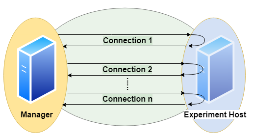

# Concepts

## Experiment

An **experiment** is organized in *queries*.
A **query** is a statement, that is understood by a Database Management System (DBMS).

## Single Query

A **benchmark** of a query consists of these steps:
<p align="center">

</p>

1. Establish a **connection** between client and server  
This uses `jaydebeapi.connect()` (and also creates a cursor - time not measured)
1. Send the query from client to server and
1. **Execute** the query on server  
These two steps use `execute()` on a cursor of the JDBC connection
1. **Transfer** the result back to client  
This uses `fetchall()` on a cursor of the JDBC connection
1. Close the connection  
This uses `close()` on the cursor and the connection

The times needed for steps connection (1.), execution (2. and 3.) and transfer (4.) are measured on the client side.
A unit of connect, send, execute and transfer is called a **run**. Connection time will be zero if an existing connection is reused.
A sequence of runs between establishing and discarding a connection is called a **session**.

## Basic Parameters

A basic parameter of a query is the **number of runs** (units of send, execute, transfer).
To configure sessions it is also possible to adjust
* the **number of runs per connection** (session length, to have several sequential connections) and  
* the **number of parallel connections** (to simulate several simultanious clients)
* a **timeout** (maximum lifespan of a connection)
* a **delay** for throttling (waiting time before each connection or execution)

for the same query.

<p align="center">

</p>

Parallel clients are simulated using the `pool.apply_async()` method of a `Pool` object of the module [multiprocessing](https://docs.python.org/3/library/multiprocessing.html).
Runs and their benchmark times are ordered by numbering.

We can specify a **number of warmup runs** and a **number of cooldown runs**.
This means the first n runs resp. the last n runs are ignored in evaluation.
**Note** this is only reliable for non-parallel connections.

Moreover we can **randomize** a query, such that each run will look slightly different.
This means we exchange a part of the query for a random value.

## Basic Metrics

We have several **timers** to collect timing information:

<p align="center">

</p>

* **timerConnection**  
This timer gives the time in ms and per run.  
It measures the time it takes to establish a JDBC connection.  
**Note** that if a run reuses an established connection, this timer will be 0 for that run.
* **timerExecution**  
This timer gives the time in ms and per run.  
It measures the time between sending a SQL command and receiving a result code via JDBC.
* **timerTransfer**  
This timer gives the time in ms and per run.  
**Note** that if a run does not transfer any result set (a writing query or if we suspend the result set), this timer will be 0 for that run.
* **timerRun**  
This timer gives the time in ms and per run.  
That is the sum of *timerConnection*, *timerExecution* and *timerTransfer*.  
**Note** that connection time is 0, if we reuse an established session, and transfer time is 0, if we do not transfer any result set.
* **timerSession**  
This timer gives the time in ms and per session.  
It aggregates all runs of a session and sums up their *timerRun*s.  
A session starts with establishing a connection and ends when the connection is disconnected.  
This timer ignores warmup / cooldown phases, since they are only valid for runs.

The benchmark times of a query are stored in csv files (optional pickeled pandas dataframe): For connection, execution and transfer.
The columns represent DBMS and each row contains a run.

We also measure and store the **total time** of the benchmark of the query, since for parallel execution this differs from the **sum of times** based on *timerRun*. Total time means measurement starts before first benchmark run and stops after the last benchmark run has been finished. Thus total time also includes some overhead (for spawning a pool of subprocesses, compute size of result sets and joining results of subprocesses). Additionally total time always spans all benchmarks. The sum of times on the other hand ignores warmup and cooldown phase.

We think
* the sum of times is more of an indicator for performance of the server system
* the total time is more of an indicator for the performance the client user receives.

We also compute for each query and DBMS
* **Latency**: Mean time (without warmup / cooldown)
* **Throughput**:
  * Number of runs per total time (including warmup / cooldown phase)
  * Number of parallel clients per mean time (without warmup / cooldown)

In the end we have
* Per DBMS: Total time of experiment
* Per DBMS and Query:
  * Time per session
  * Time per run
  * Time per run, split up in: connection / execution / data transfer
  * Latency and Throughputs per run
  * Latency and Throughputs per session

Additionally error messages and timestamps of begin and end of benchmarking a query are stored.


## Comparison

We can specify a dict of DBMS.
Each query will be sent to every DBMS in the same number of runs.

<p align="center">

</p>

This also respects randomization, i.e. every DBMS receives exactly the same versions of the query in the same order.

We assume all DBMS will give us the same result sets.
Without randomization, each run should yield the same result set.
This tool automatically can check these assumptions by **comparison**.
The resulting data table is handled as a list of lists and treated by this:
```
# restrict precision
data = [[round(float(item), int(query.restrict_precision)) if tools.convertToFloat(item) == float else item for item in sublist] for sublist in data]
# sort by all columns
data = sorted(data, key=itemgetter(*list(range(0,len(data[0])))))
# size of result
size = int(df.memory_usage(index=True).sum())
# hash of result
columnnames = [[i[0].upper() for i in connection.cursor.description]]
hashed = columnnames + [[hashlib.sha224(pickle.dumps(data)).hexdigest()]]
```
Result sets of different runs (not randomized) and different DBMS can be compared by their sorted table (small data sets) or their hash value or size (bigger data sets).

In order to do so, result sets (or their hash value or size) are stored as lists of lists and additionally can be saved as csv files or pickled pandas dataframes.

## Monitoring Hardware Metrics

To make these metrics available, we must [provide](#connection-file) an API URL and an API Access Token for a Grafana Server.
The tool collects metrics from the Grafana server with a step size of 1 second.
The requested interval matches the interval a specific DBMS is queried.
To increase expressiveness, it is possible to extend the scraping interval by n seconds at both ends.
In the end we have a list of per second values for each query and DBMS.
We may define the metrics in terms of promql.
Metrics can be defined per connection.

Example:
```
'title': 'CPU Memory [MB]'
'query': 'container_memory_working_set_bytes{container_label_io_kubernetes_container_name="dbms"}'

'title': 'CPU Memory Cached [MB]'
'query': 'container_memory_usage_bytes{container_label_io_kubernetes_container_name="dbms"}'

'title': 'CPU Util [%]'
'query': 'sum(irate(container_cpu_usage_seconds_total{container_label_io_kubernetes_container_name="dbms"}[1m]))'

'title': 'CPU Throttle [%]'
'query': 'sum(irate(container_cpu_cfs_throttled_seconds_total{container_label_io_kubernetes_container_name="dbms"}[1m]))'

'title': 'CPU Util Others [%]'
'query': 'sum(irate(container_cpu_usage_seconds_total{container_label_io_kubernetes_container_name!="dbms",id!="/"}[1m]))'

'title': 'Net Rx [b]'}, 'total_network_tx'
'query': 'sum(container_network_receive_bytes_total{container_label_app="dbmsbenchmarker"})'

'title': 'Net Tx [b]'
'query': 'sum(container_network_transmit_bytes_total{container_label_app="dbmsbenchmarker"})'

'title': 'FS Read [b]'
'query': 'sum(container_fs_reads_bytes_total{container_label_io_kubernetes_container_name="dbms"})'

'title': 'FS Write [b]'
'query': 'sum(container_fs_writes_bytes_total{container_label_io_kubernetes_container_name="dbms"})'

'title': 'GPU Util [%]'
'query': 'DCGM_FI_DEV_GPU_UTIL{UUID=~"GPU-4d1c2617-649d-40f1-9430-2c9ab3297b79"}'

'title': 'GPU Power Usage [W]'
'query': 'DCGM_FI_DEV_POWER_USAGE{UUID=~"GPU-4d1c2617-"}'

'title': 'GPU Memory [MiB]'
'query': 'DCGM_FI_DEV_FB_USED{UUID=~"GPU-4d1c2617-"}'
```

**Note** this expects monitoring to be installed properly and naming to be appropriate. See https://github.com/Beuth-Erdelt/Benchmark-Experiment-Host-Manager for a working example and more details.

**Note** this has limited validity, since metrics are typically scraped only on a basis of several seconds. It works best with a high repetition of the same query.

## Evaluation

**TODO: Multi-Dimensional**
As a result we obtain measured times in milliseconds for the query processing parts: connection, execution, data transfer.
These are described in three dimensions:
number of run, number of query and number of configuration.
The configurations can consist of various parameters like DBMS, selected processor, assigned cluster node, number of clients and execution order.
We also can have various hardware metrics like CPU and GPU utilization, CPU throttling, memory caching and working set.
These are also described in three dimensions:
Second of query execution time, number of query and number of configuration.
All these metrics can be sliced or diced, rolled-up or drilled-down into the various dimensions using several aggregation functions.

### Statistical Measures

Currently the following statistics are computed:
* Sensitive to outliers
  * Arithmetic mean
  * Standard deviation
  * Coefficient of variation
* Insensitive to outliers
  * Median
  * Interquartile range
  * Quartile coefficient of dispersion


