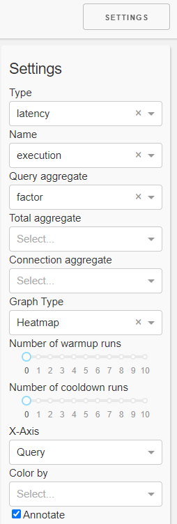
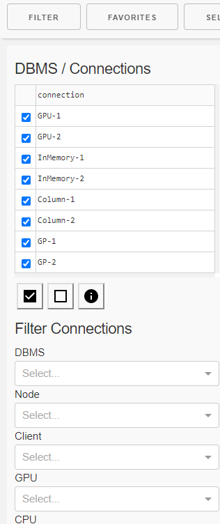

# Dashboard

The dashboard helps in interactive evaluation of experiment results.

<p align="center">

</p>

## Start

The dashboard is started using a Python script:

`python dashboard.py -h`

```usage: aio-app.py [-h] [-r RESULT_FOLDER] [-a]

Dashboard for interactive inspection of dbmsbenchmarker results.

optional arguments:
  -h, --help            show this help message and exit
  -r RESULT_FOLDER, --result-folder RESULT_FOLDER
                        Folder storing benchmark result files.
  -a, --anonymize       Anonymize all dbms.
```

It has two options:
* `--result-folder`: Path of a local folder containing result folders. This parameter is the same as for `benchmark.py`
* `--anonymize`: If this flag is set, all DBMS are anonymized following the parameters in their [configuration](Options.md#connection-file).

When you start the dashboard it is available at `localhost:8050`.

### Select Experiment

You will be shown a list of experiments available at the path you have provided.
Select one experiment.
Optionally you can activate to have some default panels opened to you.

## Concept

The dashboard analyzes the data in [three dimensions](Concept.md#evaluation) using various [aggregation functions](Concept.md#aggregation-functions):
<p align="center">

</p>

### Data

The cells of the runtime cube contains
* Timer (connection, execution, data transfer)
* Derived metrics (latencies, throughput)

The cells of the monitoring cube contains
* Hardware metrics

### Graph Panels

The dashboard is organized into 12 columns and several rows depending on the screen size.

For a graph panel you can
* change width (number of columns)
* change height (number of rows)
* change ordering on the dashboard
* activate settings
* download underlying data as csv

#### Graph Types

Available types of display are
* Line Plot
* Boxplot
* Histogramm
* Bar Chart
* Heatmap
* Table of Measures
* Table of Statistics
These can be applied to sliced / diced / aggregated data of the cubes.

There are also some preset graphs
* Heatmap of Errors
* Heatmap of Warnings
* Heatmap Result Set Size
* Heatmap Total Time
* Heatmap Latency Run
* Heatmap Throughput Run
* Heatmap Timer Run Factor
* Bar Chart Run drill-down
* Bar Chart Ingestion Time


## Menu

The menu allows you to
* open the [filtering](#filter) panel
* open the [favorites](#favorites) panel
* [select](#select-experiment) (change to) an experiment
* see details about the current experiment
* activate all panels on the current dashboard
* close all active panels on the current dashboard
* add a [graph](#graph-panels) (panel)
* open the [settings](#settings) panel

## Favorites

The favorites menu allows you to
* load a dashboard
* append a list of panels to the current dashboard
* save the current list of panels as a favorite
* download a favorite
* upload a favorite

## Settings



In the settings panel you can select the
* [Kind of measure](#data) you want to inspect (kind, name)
* [Type](#graph-panels) of plot (graph type, x-axis, annotate)
* [Aggregation functions](Concept.md#aggregation-functions).
  The order of aggregation is
  1. Query (run dimension)
  1. Total (query dimension)
  1. Connection (configuration dimension)  
  Aggregation in the connection dimension can be drilled-down (color by)
* number of (excluded) warmup and cooldown runs

## Filter



In the filter panel you can filter
* one or more connections (configurations) using
  * a checkbox list of single connections
  * property filters
    * DBMS
    * Cluster node
    * Number of clients
    * CPU
    * GPU
* single queries

Moreover you can receive details about
* the connections (configurations)
  * [Configuration](Options.md#connection-file)
  * DBMS
  * Resources
* and the queries like
  * [Configuration](Options.md#query-file)
  * Number of runs
  * Result sets 

