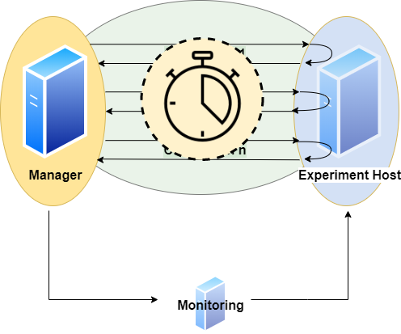

# DBMS-Benchmarker

DBMS-Benchmarker is a Python-based application-level blackbox benchmark tool for Database Management Systems (DBMS).
It aims at reproducible measuring and easy evaluation of the performance the user receives even in complex benchmark situations.
It connects to a given list of DBMS (via JDBC) and runs a given list of (SQL) benchmark queries.
Queries can be parametrized and randomized.
Results and evaluations are available via a Python interface and can be inspected for example in Jupyter notebooks.
An interactive dashboard assists in multi-dimensional analysis of the results.

See the [homepage](https://github.com/Beuth-Erdelt/DBMS-Benchmarker) and the [documentation](https://dbmsbenchmarker.readthedocs.io/en/latest/Docs.html).

# Need

@ErdeltOrchestrator, @Erdelt20

Run `pip install dbmsbenchmarker` for installation.

# Solution

The lists of [DBMS](#connection-file) and [queries](#query-file) are given in config files in dict format.

Benchmarks can be [parametrized](#query-file) by
* number of benchmark runs: *Is performance stable across time?*
* number of benchmark runs per connection: *How does reusing a connection affect performance?*
* number of warmup and cooldown runs, if any: *How does (re)establishing a connection affect performance?*
* number of parallel clients: *How do multiple user scenarios affect performance?*
* optional list of timers (currently: connection, execution, data transfer, run and session): *Where does my time go?*
* [sequences](#query-list) of queries: *How does sequencing influence performance?*
* optional [comparison](#results-and-comparison) of result sets: *Do I always receive the same results sets?*

Benchmarks can be [randomized](#randomized-query-file) (optionally with specified [seeds](#random-seed) for reproducible results) to avoid caching side effects and to increase variety of queries by taking samples of arbitrary size from a
* list of elements
* dict of elements (one-to-many relations)
* range of integers
* range of floats
* range of days
* range of (first of) months
* range of years

This is inspired by [TPC-H](http://www.tpc.org/tpch/) and [TPC-DS](http://www.tpc.org/tpcds/) - Decision Support Benchmarks.

# Basic Example

The following very simple use case runs the query `SELECT COUNT(*) FROM test` 10 times against one local (existing) MySQL installation.
We assume here we have downloaded the required JDBC driver, e.g. `mysql-connector-java-8.0.13.jar`.

## Configuration

### DBMS configuration file, e.g. in `./config/connections.config`  

```
[
  {
    'name': "MySQL",
    'active': True,
    'JDBC': {
      'driver': "com.mysql.cj.jdbc.Driver",
      'url': "jdbc:mysql://localhost:3306/database",
      'auth': ["username", "password"],
      'jar': "mysql-connector-java-8.0.13.jar"
    }
  }
]
```

### Queries configuration file, e.g. in `./config/queries.config`  

```
{
  'name': 'Some simple queries',
  'connectionmanagement': {
        'timeout': 5 # in seconds
    },
  'queries':
  [
    {
      'title': "Count all rows in test",
      'query': "SELECT COUNT(*) FROM test",
      'numRun': 10
    }
  ]
}
```


## Perform Benchmark

Run the CLI command: `dbmsbenchmarker run -e yes -b -f ./config`

After benchmarking has been finished we will see a message like `Experiment <code> has been finished`.
The script has created a result folder in the current directory containing the results. `<code>` is the name of the folder.


## Evaluate Results in Dashboard

Run the command: `dbmsdashboard`

This will start the evaluation dashboard at `localhost:8050`.
Visit the address in a browser and select the experiment `<code>`.
Alternatively you may use a [Jupyter notebooks](https://github.com/Beuth-Erdelt/DBMS-Benchmarker/blob/master/Evaluation-Demo.ipynb), see a [rendered example](https://beuth-erdelt.github.io/DBMS-Benchmarker/Evaluation-Demo.html).


# Concepts

## Experiment

An **experiment** is organized in *queries*.
A **query** is a statement, that is understood by a Database Management System (DBMS).

## Single Query

A **benchmark** of a query consists of these steps:

{ width=320 }


1. Establish a **connection** between client and server  
This uses `jaydebeapi.connect()` (and also creates a cursor - time not measured)
1. Send the query from client to server and
1. **Execute** the query on server  
These two steps use `execute()` on a cursor of the JDBC connection
1. **Transfer** the result back to client  
This uses `fetchall()` on a cursor of the JDBC connection
1. Close the connection  
This uses `close()` on the cursor and the connection

The times needed for steps connection (1.), execution (2. and 3.) and transfer (4.) are measured on the client side.
A unit of connect, send, execute and transfer is called a **run**. Connection time will be zero if an existing connection is reused.
A sequence of runs between establishing and discarding a connection is called a **session**.

## Basic Parameters

A basic parameter of a query is the **number of runs** (units of send, execute, transfer).
To configure sessions it is also possible to adjust

* the **number of runs per connection** (session length, to have several sequential connections) and
* the **number of parallel connections** (to simulate several simultanious clients)
* a **timeout** (maximum lifespan of a connection)
* a **delay** for throttling (waiting time before each connection or execution)

for the same query.

{ width=320 }

Parallel clients are simulated using the `pool.apply_async()` method of a `Pool` object of the module [multiprocessing](https://docs.python.org/3/library/multiprocessing.html).
Runs and their benchmark times are ordered by numbering.
Moreover we can **randomize** a query, such that each run will look slightly different.
This means we exchange a part of the query for a random value.

## Basic Metrics

We have several **timers** to collect timing information:

{ width=320 }

* **timerConnection**  
This timer gives the time in ms and per run.  
It measures the time it takes to establish a JDBC connection.  
**Note** that if a run reuses an established connection, this timer will be 0 for that run.
* **timerExecution**  
This timer gives the time in ms and per run.  
It measures the time between sending a SQL command and receiving a result code via JDBC.
* **timerTransfer**  
This timer gives the time in ms and per run.  
**Note** that if a run does not transfer any result set (a writing query or if we suspend the result set), this timer will be 0 for that run.
* **timerRun**  
This timer gives the time in ms and per run.  
That is the sum of *timerConnection*, *timerExecution* and *timerTransfer*.  
**Note** that connection time is 0, if we reuse an established session, and transfer time is 0, if we do not transfer any result set.
* **timerSession**  
This timer gives the time in ms and per session.  
It aggregates all runs of a session and sums up their *timerRun*s.  
A session starts with establishing a connection and ends when the connection is disconnected.  

The benchmark times of a query are stored in csv files (optional pickeled pandas dataframe): For connection, execution and transfer.
The columns represent DBMS and each row contains a run.

We also measure and store the **total time** of the benchmark of the query, since for parallel execution this differs from the **sum of times** based on *timerRun*. Total time means measurement starts before first benchmark run and stops after the last benchmark run has been finished. Thus total time also includes some overhead (for spawning a pool of subprocesses, compute size of result sets and joining results of subprocesses).
Thus the sum of times is more of an indicator for performance of the server system, the total time is more of an indicator for the performance the client user receives.
We also compute for each query and DBMS
* **Latency** (measured Time)
* **Throughput** (number of parallel clients per mean time).
Additionally error messages and timestamps of begin and end of benchmarking a query are stored.


## Comparison

We can specify a dict of DBMS.
Each query will be sent to every DBMS in the same number of runs.

{ width=320 }

This also respects randomization, i.e. every DBMS receives exactly the same versions of the query in the same order.
We assume all DBMS will give us the same result sets.
Without randomization, each run should yield the same result set.
This tool automatically can check these assumptions by **comparison**.
The resulting data table is handled as a list of lists and treated by this:
Result sets of different runs (not randomized) and different DBMS can be compared by their sorted table (small data sets) or their hash value or size (bigger data sets).
In order to do so, result sets (or their hash value or size) are stored as lists of lists and additionally can be saved as csv files or pickled pandas dataframes.

## Monitoring Hardware Metrics

To make hardware metrics available, we must [provide](#connection-file) an API URL for a Prometheus Server.
The tool collects metrics from the Prometheus server with a step size of 1 second.

{ width=320 }

The requested interval matches the interval a specific DBMS is queried.
To increase expressiveness, it is possible to extend the scraping interval by n seconds at both ends.
In the end we have a list of per second values for each query and DBMS.
We may define the metrics in terms of **promql**.
Metrics can be defined per connection.

**Note** this expects monitoring to be installed properly and naming to be appropriate. See https://github.com/Beuth-Erdelt/Benchmark-Experiment-Host-Manager for a working example and more details.

**Note** this has limited validity, since metrics are typically scraped only on a basis of several seconds. It works best with a high repetition of the same query.

## Evaluation

As a result we obtain measured times in milliseconds for the query processing parts: connection, execution, data transfer.

{ width=480 }

These are described in three dimensions:
number of run, number of query and configuration.
The configuration dimension can consist of various nominal attributes like DBMS, selected processor, assigned cluster node, number of clients and execution order.
We also can have various hardware metrics like CPU and GPU utilization, CPU throttling, memory caching and working set.
These are also described in three dimensions:
Second of query execution time, number of query and number of configuration.

All these metrics can be sliced or diced, rolled-up or drilled-down into the various dimensions using several aggregation functions for evaluation.


## Dashboard

The dashboard helps in interactive evaluation of experiment results.

<p align="center">

</p>

{ width=640}


# Acknowledgements


# References