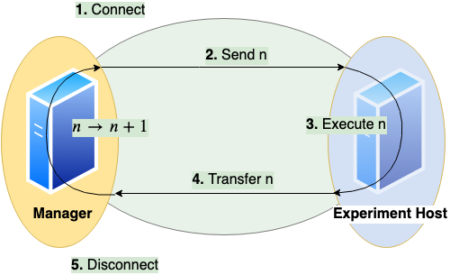

# Summary

DBMS-Benchmarker is a Python-based application-level blackbox benchmark tool for Database Management Systems (DBMS).
It aims at reproducible measuring and easy evaluation of the performance the user receives even in complex benchmark situations.
It connects to a given list of DBMS (via JDBC) and runs a given list of (SQL) benchmark queries.
Queries can be parametrized and randomized.
Results and evaluations are available via a Python interface and can be inspected with standard Python tools like pandas DataFrames.
An interactive visual dashboard assists in multi-dimensional analysis of the results.

This module has been tested with Clickhouse, Exasol, Citus Data (Hyperscale), IBM DB2, MariaDB, MariaDB Columnstore, MemSQL (SingleStore), MonetDB, MySQL, OmniSci (HEAVY.AI) , Oracle DB, PostgreSQL, SQL Server, SAP HANA, TimescaleDB and Vertica.

See the [homepage](https://github.com/Beuth-Erdelt/DBMS-Benchmarker) and the [documentation](https://dbmsbenchmarker.readthedocs.io/en/latest/Docs.html).

# Statement of Need

Performance benchmarking of database management systems (DBMS) is an active research area and has a broad audience. It is used "*by DBMS developers to evaluate their work and to find out which algorithm works best in which situation. Benchmarks are used by (potential) customers to evaluate what system or hardware to buy or rent. Benchmarks are used by administrators to find bottlenecks and adjust configurations. Benchmarks are used by users to compare semantically equivalent queries and to find the best formulation alternative*", @10.1007/978-3-030-84924-5_6.
Also in the academic field, approaches and their special implementations are examined in benchmarks.
There is a large variety of DBMS types and products.
For example @DBEngines ranks 350 DBMS (150 Relational), @DBDBIO lists 850 DBMS (280 Relational).
We focus on Relational DBMS (RDBMS) in the following.
The types thereof can be divided into for example row-wise, column-wise, in-memory, distributed and GPU-enhanced. 
All of these products have unique characteristics, special use cases, advantages and disadvantages, and their own justification.
In order to be able to verify and ensure the performance measurement, we want to be able to create and repeat benchmarking scenarios.
Repetition and thorough evaluation are crucial, in particular in the age of Cloud-based systems with its diversity of hardware configurations, @Raasveldt2018FBC32099503209955, @DBLPconfsigmodKerstenKZ18, @KounevLK20.

Thus there is a widespread need for a tool to support the repetition and reproducibility of benchmarking situations, and that is capable of connecting to all these systems.

When we collect a lot of data during benchmarking processes, we also need a tool that will help with the statistical, visual and interactive analysis of the results.
The authors advocate using Python as a common Data Science language, since
"*it is a mature language programming, easy for the newbies, and can be used as a specific platform for data scientists, thanks to its large ecosystem of scientific libraries and its high and vibrant community*", @series/utcs/IgualS17.
This helps to implement the tool into a pipeline, for example to make use of closed-loop benchmarking situations, @10114533389063338912, or to closely inspect parts of queries, @DBLPconfsigmodKerstenKZ18.
It also allows the use of common and sophisticated tools to inspect and evaluate the results.
To name a few:
Pandas for statistical evaluation of tabular data, @reback2020pandas, @mckinney-proc-scipy-2010,
Scipy for scientific investigation of data, @2020SciPy-NMeth,
IPython and Jupyter notebooks for interactive analysis and display of results, @Kluyver2016jupyter,
Matplotlib and Seaborn for visual analysis, @Hunter:2007, @Waskom2021,
or even Machine Learning tools.
Moreover Python is currently the most popular computer language, @PYPL, @TIOBE.

To our knowledge there is no other such tool, c.f. also the studies in @10.1007/978-3-319-67162-8_12 and @10.1007/978-3-030-12079-5_4.
There are other tools like Apache JMeter (Java), HammerDB (Tcl), Sysbench (LuaJIT), OLTPBench (Java) and BenchBase (Java), that provide very nice features.
However they do not fit these needs, since they are not Python-based. Moreover some are limited in supported DBMS, in supporting repetition and (statistical) evaluation or do not support randomized queries.
The design decisions of this tool have been elaborated in more detail in @10.1007/978-3-030-84924-5_6.
DBMS-Benchmarker has been used as a support for receiving scientific results about benchmarking DBMS performance in Cloud environments as in @10.1007/978-3-030-84924-5_6 and @10.1007/978-3-030-94437-7_6.

## Summary of Solution

DBMS-Benchmarker is Python3-based and helps to **benchmark DBMS**. It

* connects to all DBMS having a JDBC interface
* requires *only* JDBC - no vendor specific supplements are used
* benchmarks arbitrary SQL queries
* supports planning of complex test scenarios
* allows easy repetition of benchmarks in varying settings
* allows randomized queries to avoid caching side effects
* investigates a number of timing aspects
* investigates a number of other aspects - received result sets, precision, number of clients
* collects hardware metrics from a Prometheus server, @208870

DBMS-Benchmarker helps to **evaluate results** - by providing    

* metrics that can be analyzed by aggregation in multi-dimensions
* predefined evaluations like statistics
* in standard Python data structures
* in Jupyter notebooks - see [rendered example](https://beuth-erdelt.github.io/DBMS-Benchmarker/Evaluation-Demo.html)
* in an interactive dashboard

Some features are inspired by [TPC-H](http://www.tpc.org/tpch/) and [TPC-DS](http://www.tpc.org/tpcds/) - Decision Support Benchmarks, which are provided in part as predefined configs.


# A Basic Example

The following simple use case runs the query `SELECT COUNT(*) FROM test` 10 times against one local (existing) MySQL installation.

Run `pip install dbmsbenchmarker` for installation. Make sure Java is set up correctly.
We assume here we have downloaded the required JDBC driver, e.g. `mysql-connector-java-8.0.13.jar`.

## Configuration

### DBMS configuration file, e.g. in `./config/connections.config`  

```
[
  {
    'name': "MySQL",
    'active': True,
    'JDBC': {
      'driver': "com.mysql.cj.jdbc.Driver",
      'url': "jdbc:mysql://localhost:3306/database",
      'auth': ["username", "password"],
      'jar': "mysql-connector-java-8.0.13.jar"
    }
  }
]
```

### Queries configuration file, e.g. in `./config/queries.config`  

```
{
  'name': 'Some simple queries',
  'connectionmanagement': {
        'timeout': 5 # in seconds
    },
  'queries':
  [
    {
      'title': "Count all rows in test",
      'query': "SELECT COUNT(*) FROM test",
      'numRun': 10
    }
  ]
}
```


## Perform Benchmark and Evaluate Results

Run the CLI command: `dbmsbenchmarker run -e yes -b -f ./config`

After benchmarking has been finished we will see a message like `Experiment <code> has been finished`.
The script has created a result folder in the current directory containing the results. `<code>` is the name of the folder.

Run the CLI command: `dbmsdashboard`

This will start the evaluation dashboard at `localhost:8050`.
Visit the address in a browser and select the experiment `<code>`.
Alternatively you may use Python's pandas.


# Description

## Experiment

An **experiment** is organized in *queries*.
A **query** is a statement that is understood by a Database Management System (DBMS).

## Single Query

A **benchmark of a query** consists of these steps:

{ width=960}


1. Establish a **connection** between client and server  
This uses `jaydebeapi.connect()` (and also creates a cursor - time not measured)
1. Send the query from client to server and
1. **Execute** the query on server  
These two steps use `execute()` on a cursor of the JDBC connection
1. **Transfer** the result back to client  
This uses `fetchall()` on a cursor of the JDBC connection
1. Close the connection  
This uses `close()` on the cursor and the connection

The times needed for steps connection (1.), execution (2. and 3.) and transfer (4.) are measured on the client side.
A unit of connect, send, execute and transfer of a single query is called a **run**.
Connection time will be zero if an existing connection is reused.
A sequence of units of sending, executing, and transmitting between establishing and discarding a connection is called a **session**.
This is the same as a run, if we always reconnect prior to sending a query, but if we choose to reuse a connection this will cover multiple runs.

A basic parameter of a query is the **number of runs**.
To configure sessions it is also possible to adjust

* the **number of runs per connection** (session length) and
* the **number of parallel connections** (to simulate several simultanious clients)
* a **timeout** (maximum lifespan of a connection)
* a **delay** for throttling (waiting time before each connection or execution)

for the same query.
Parallel clients are simulated using the `pool.apply_async()` method of a `Pool` object of the module `multiprocessing`.
Runs and their benchmark times are ordered by numbering.
Moreover we can **randomize** a query, such that each run will look slightly different.
This means we exchange a part of the query for a random value.


## Basic Metrics

We have several **timers** to collect timing information in milliseconds and per run, corresponding to the parts of query processing: **timerConnection**, **timerExecution** and **timerTransfer**.
The tool also computes **timerRun** (the sum of *timerConnection*, *timerExecution* and *timerTransfer*) and **timerSession**.

We also measure and store the **total time** of the benchmark of the query, since for parallel execution this differs from the **sum of times** based on *timerRun*. Total time means measurement starts before the first benchmark run and it stops after the last benchmark run has finished. Thus total time also includes some overhead (for spawning a pool of subprocesses, compute size of result sets and joining results of subprocesses).
We also compute for each query and DBMS **latency** (measured time) and **throughput** (number of parallel clients per measured time).
Additionally error messages and timestamps of begin and end of benchmarking a query are stored.


## Comparison

We can specify a dict of DBMS.
Each query will be sent to every DBMS in the same number of runs.
This also respects randomization, i.e. every DBMS receives exactly the same versions of the query in the same order.
We assume all DBMS will give us the same result sets.
Without randomization, each run should yield the same result set.
The tool automatically can check these assumptions by **comparison** of sorted result tables (small data sets) or their hash value or size (bigger data sets).
In order to do so, result sets (or their hash value or size) are stored as lists of lists and additionally can be saved as csv files or pickled pandas DataFrames.

## Monitoring Hardware Metrics

To make hardware metrics available, we must provide an API URL of a Prometheus Server.
The tool collects metrics from the Prometheus server with a step size of 1 second.
We may define the metrics in terms of Prometheus's **promql**.
Metrics can be defined per connection.

## Results

As a result we obtain measured times in milliseconds for the query processing parts: connection, execution, data transfer.

{ width=1440}

These are described in three dimensions:
number of run, of query and of configuration.
The configuration dimension can consist of various nominal attributes like DBMS, selected processor, assigned cluster node, number of clients and execution order.
We also can have various hardware metrics like CPU and GPU utilization, CPU throttling, memory caching and working set.
These are also described in three dimensions:
Second of query execution time, number of query and of configuration.

# Evaluation

## Python - Pandas

The cubes of measurements can be sliced or diced, rolled-up or drilled-down into the various dimensions and several aggregation functions for evaluation of the metrics can be applied:
First, last, minimum, maximum, arithmetic and geometric mean, range and interquartile range, standard deviation, median, some quantiles, coefficient of variation and quartile coefficient of dispersion.
This helps in univariate analysis of center and dispersion of the metrics to evaluate measures and stability.

The package includes tools to convert the three dimensional results into pandas DataFrames, like covering errors and warnings, that have occured, and timing and hardware metrics, that have been collected or derived.
For example the latency of execution, aggregated in the query dimension by computing the mean value, can be obtained as:

```
df = evaluate.get_aggregated_query_statistics(
    type='latency', name='execution', query_aggregate='Mean')
```

{ width=1440}

## GUI - Dashboard

The package includes a dashboard helping in interactive evaluation of experiment results.
It shows predefined plots of various types, that can be customized and filtered by DBMS configuration and query.

{ width=1440}


# Acknowledgements

We acknowledge contributions from Andre Bubbel to include TPC-DS queries.

# References