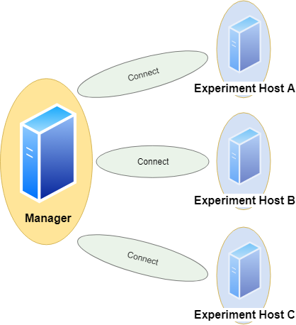

# DBMS-Benchmarker

DBMS-Benchmarker is a Python-based application-level blackbox benchmark tool for Database Management Systems (DBMS).
It aims at reproducible measuring and easy evaluation of the performance the user receives even in complex benchmark situations.
It connects to a given list of DBMS (via JDBC) and runs a given list of (SQL) benchmark queries.
Queries can be parametrized and randomized.
Results and evaluations are available via a Python interface.
Optionally some reports are generated.
An interactive dashboard assists in multi-dimensional analysis of the results.

See the [homepage](https://github.com/Beuth-Erdelt/DBMS-Benchmarker) and the [documentation](https://dbmsbenchmarker.readthedocs.io/en/latest/Docs.html).

# Need

@ErdeltOrchestrator, @Erdelt20

## Key Features

DBMS-Benchmarker
* is Python3-based
* helps to **benchmark DBMS**
  * connects to all DBMS having a JDBC interface - including GPU-enhanced DBMS
  * requires *only* JDBC - no vendor specific supplements are used
  * benchmarks arbitrary SQL queries - in all dialects
  * allows planning of complex test scenarios - to simulate realistic or revealing use cases
  * allows easy repetition of benchmarks in varying settings - different hardware, DBMS, DBMS configurations, DB settings etc
  * investigates a number of timing aspects - connection, execution, data transfer, in total, per session etc
  * investigates a number of other aspects - received result sets, precision, number of clients
  * collects hardware metrics from a Prometheus server - hardware utilization, energy consumption etc
* helps to **evaluate results** - by providing  
  * metrics that can be analyzed by aggregation in multi-dimensions, like maximum throughput per DBMS, average CPU utilization per query or geometric mean of run latency per workload
  * predefined evaluations like statistics
  * in standard Python data structures
  * in [Jupyter notebooks](https://github.com/Beuth-Erdelt/DBMS-Benchmarker/blob/master/Evaluation-Demo.ipynb)
  see [rendered example](https://beuth-erdelt.github.io/DBMS-Benchmarker/Evaluation-Demo.html)  
  * in an [interactive dashboard](Dashboard.html)

For more informations, see a [basic example](#basic-usage) or take a look in the [documentation](https://dbmsbenchmarker.readthedocs.io/en/latest/Docs.html) for a full list of options.

The code uses several Python modules, in particular <a href="https://github.com/baztian/jaydebeapi" target="_blank">jaydebeapi</a> for handling DBMS.
This module has been tested with Brytlyt, Citus, Clickhouse, DB2, Exasol, Kinetica, MariaDB, MariaDB Columnstore, MemSQL, Mariadb, MonetDB, MySQL, OmniSci, Oracle DB, PostgreSQL, SingleStore, SQL Server and SAP HANA.

## Installation

Run `pip install dbmsbenchmarker`

## Basic Usage

The following very simple use case runs the query `SELECT COUNT(*) FROM test` 10 times against one local MySQL installation.
As a result we obtain an interactive dashboard to inspect timing aspects.

### Configuration

We need to provide
* a [DBMS configuration file](Options.html#connection-file), e.g. in `./config/connections.config`  
```
[
  {
    'name': "MySQL",
    'active': True,
    'JDBC': {
      'driver': "com.mysql.cj.jdbc.Driver",
      'url': "jdbc:mysql://localhost:3306/database",
      'auth': ["username", "password"],
      'jar': "mysql-connector-java-8.0.13.jar"
    }
  }
]
```
* the required JDBC driver, e.g. `mysql-connector-java-8.0.13.jar`
* a [Queries configuration file](Options.html#query-file), e.g. in `./config/queries.config`  
```
{
  'name': 'Some simple queries',
  'connectionmanagement': {
        'timeout': 5 # in seconds
    },
  'queries':
  [
    {
      'title': "Count all rows in test",
      'query': "SELECT COUNT(*) FROM test",
      'numRun': 10
    }
  ]
}
```


### Perform Benchmark

Run the CLI command: `dbmsbenchmarker run -e yes -b -f ./config`

* `-e yes`: This will precompile some evaluations and generate the timer cube.
* `-b`: This will suppress some output
* `-f`: This points to a folder having the configuration files.

This is equivalent to `python benchmark.py run -e yes -b -f ./config`

After benchmarking has been finished we will see a message like
```
Experiment <code> has been finished
```

The script has created a result folder in the current directory containing the results. `<code>` is the name of the folder.


### Evaluate Results in Dashboard

Run the command: `dbmsdashboard`

This will start the evaluation dashboard at `localhost:8050`.
Visit the address in a browser and select the experiment `<code>`.

This is equivalent to `python dashboard.py`.

Alternatively you may use a [Jupyter notebooks](https://github.com/Beuth-Erdelt/DBMS-Benchmarker/blob/master/Evaluation-Demo.ipynb), see a [rendered example](https://beuth-erdelt.github.io/DBMS-Benchmarker/Evaluation-Demo.html).


# Concepts

## Experiment

An **experiment** is organized in *queries*.
A **query** is a statement, that is understood by a Database Management System (DBMS).

## Single Query

A **benchmark** of a query consists of these steps:

{ width=320 }


1. Establish a **connection** between client and server  
This uses `jaydebeapi.connect()` (and also creates a cursor - time not measured)
1. Send the query from client to server and
1. **Execute** the query on server  
These two steps use `execute()` on a cursor of the JDBC connection
1. **Transfer** the result back to client  
This uses `fetchall()` on a cursor of the JDBC connection
1. Close the connection  
This uses `close()` on the cursor and the connection

The times needed for steps connection (1.), execution (2. and 3.) and transfer (4.) are measured on the client side.
A unit of connect, send, execute and transfer is called a **run**. Connection time will be zero if an existing connection is reused.
A sequence of runs between establishing and discarding a connection is called a **session**.

## Basic Parameters

A basic parameter of a query is the **number of runs** (units of send, execute, transfer).
To configure sessions it is also possible to adjust

* the **number of runs per connection** (session length, to have several sequential connections) and
* the **number of parallel connections** (to simulate several simultanious clients)
* a **timeout** (maximum lifespan of a connection)
* a **delay** for throttling (waiting time before each connection or execution)

for the same query.

{ width=320 }

Parallel clients are simulated using the `pool.apply_async()` method of a `Pool` object of the module [multiprocessing](https://docs.python.org/3/library/multiprocessing.html).
Runs and their benchmark times are ordered by numbering.

Moreover we can **randomize** a query, such that each run will look slightly different.
This means we exchange a part of the query for a random value.

## Basic Metrics

We have several **timers** to collect timing information:

{ width=320 }

* **timerConnection**  
This timer gives the time in ms and per run.  
It measures the time it takes to establish a JDBC connection.  
**Note** that if a run reuses an established connection, this timer will be 0 for that run.
* **timerExecution**  
This timer gives the time in ms and per run.  
It measures the time between sending a SQL command and receiving a result code via JDBC.
* **timerTransfer**  
This timer gives the time in ms and per run.  
**Note** that if a run does not transfer any result set (a writing query or if we suspend the result set), this timer will be 0 for that run.
* **timerRun**  
This timer gives the time in ms and per run.  
That is the sum of *timerConnection*, *timerExecution* and *timerTransfer*.  
**Note** that connection time is 0, if we reuse an established session, and transfer time is 0, if we do not transfer any result set.
* **timerSession**  
This timer gives the time in ms and per session.  
It aggregates all runs of a session and sums up their *timerRun*s.  
A session starts with establishing a connection and ends when the connection is disconnected.  

The benchmark times of a query are stored in csv files (optional pickeled pandas dataframe): For connection, execution and transfer.
The columns represent DBMS and each row contains a run.

We also measure and store the **total time** of the benchmark of the query, since for parallel execution this differs from the **sum of times** based on *timerRun*. Total time means measurement starts before first benchmark run and stops after the last benchmark run has been finished. Thus total time also includes some overhead (for spawning a pool of subprocesses, compute size of result sets and joining results of subprocesses).
Thus the sum of times is more of an indicator for performance of the server system, the total time is more of an indicator for the performance the client user receives.

We also compute for each query and DBMS

* **Latency**: Measured Time
* **Throughput**: 
  * Number of runs per total time
  * Number of parallel clients per mean time

In the end we have

* Per DBMS: Total time of experiment
* Per DBMS and Query:
  * Time per session
  * Time per run
  * Time per run, split up in: connection / execution / data transfer
  * Latency and Throughputs per run
  * Latency and Throughputs per session

Additionally error messages and timestamps of begin and end of benchmarking a query are stored.


## Comparison

We can specify a dict of DBMS.
Each query will be sent to every DBMS in the same number of runs.

{ width=320 }

This also respects randomization, i.e. every DBMS receives exactly the same versions of the query in the same order.

We assume all DBMS will give us the same result sets.
Without randomization, each run should yield the same result set.
This tool automatically can check these assumptions by **comparison**.
The resulting data table is handled as a list of lists and treated by this:
```
# restrict precision
data = [[round(float(item), int(query.restrict_precision)) if tools.convertToFloat(item) == float else item for item in sublist] for sublist in data]
# sort by all columns
data = sorted(data, key=itemgetter(*list(range(0,len(data[0])))))
# size of result
size = int(df.memory_usage(index=True).sum())
# hash of result
columnnames = [[i[0].upper() for i in connection.cursor.description]]
hashed = columnnames + [[hashlib.sha224(pickle.dumps(data)).hexdigest()]]
```
Result sets of different runs (not randomized) and different DBMS can be compared by their sorted table (small data sets) or their hash value or size (bigger data sets).

In order to do so, result sets (or their hash value or size) are stored as lists of lists and additionally can be saved as csv files or pickled pandas dataframes.

## Monitoring Hardware Metrics

To make hardware metrics available, we must [provide](Options.html#connection-file) an API URL for a Prometheus Server.
The tool collects metrics from the Prometheus server with a step size of 1 second.

{ width=320 }

The requested interval matches the interval a specific DBMS is queried.
To increase expressiveness, it is possible to extend the scraping interval by n seconds at both ends.
In the end we have a list of per second values for each query and DBMS.
We may define the metrics in terms of promql.
Metrics can be defined per connection.

Example:
```
'title': 'CPU Memory [MB]'
'query': 'container_memory_working_set_bytes'

'title': 'CPU Memory Cached [MB]'
'query': 'container_memory_usage_bytes'

'title': 'CPU Util [%]'
'query': 'sum(irate(container_cpu_usage_seconds_total[1m]))'

'title': 'CPU Throttle [%]'
'query': 'sum(irate(container_cpu_cfs_throttled_seconds_total[1m]))'

'title': 'CPU Util Others [%]'
'query': 'sum(irate(container_cpu_usage_seconds_total{id!="/"}[1m]))'

'title': 'Net Rx [b]'
'query': 'sum(container_network_receive_bytes_total{)'

'title': 'Net Tx [b]'
'query': 'sum(container_network_transmit_bytes_total{)'

'title': 'FS Read [b]'
'query': 'sum(container_fs_reads_bytes_total)'

'title': 'FS Write [b]'
'query': 'sum(container_fs_writes_bytes_total)'

'title': 'GPU Util [%]'
'query': 'DCGM_FI_DEV_GPU_UTIL{UUID=~"GPU-4d1c2617-649d-40f1-9430-2c9ab3297b79"}'

'title': 'GPU Power Usage [W]'
'query': 'DCGM_FI_DEV_POWER_USAGE{UUID=~"GPU-4d1c2617-"}'

'title': 'GPU Memory [MiB]'
'query': 'DCGM_FI_DEV_FB_USED{UUID=~"GPU-4d1c2617-"}'
```

**Note** this expects monitoring to be installed properly and naming to be appropriate. See https://github.com/Beuth-Erdelt/Benchmark-Experiment-Host-Manager for a working example and more details.

**Note** this has limited validity, since metrics are typically scraped only on a basis of several seconds. It works best with a high repetition of the same query.

## Evaluation

As a result we obtain measured times in milliseconds for the query processing parts: connection, execution, data transfer.

{ width=320 }

These are described in three dimensions:
number of run, number of query and configuration.
The configuration dimension can consist of various nominal attributes like DBMS, selected processor, assigned cluster node, number of clients and execution order.
We also can have various hardware metrics like CPU and GPU utilization, CPU throttling, memory caching and working set.
These are also described in three dimensions:
Second of query execution time, number of query and number of configuration.

All these metrics can be sliced or diced, rolled-up or drilled-down into the various dimensions using several aggregation functions for evaluation.

### Aggregation Functions

Currently the following statistics may be computed per dimension:

* Sensitive to outliers
  * Arithmetic mean
  * Standard deviation
  * Coefficient of variation
* Insensitive to outliers
  * Median - percentile 50 (Q2)
  * Interquartile range - Q3-Q1
  * Quartile coefficient of dispersion
* First
* Last
* Minimum
* Maximum
* Range (Maximum - Minimum)
* Sum
* Geometric Mean
* percentile 25 (Q1)
* percentile 75 (Q3)
* percentile 90 - leave out highest 10%
* percentile 95 - leave out highest 5%

In the complex configuration dimension it can be interesting to aggregate to groups like same DBMS or CPU type.

# Usage

## Featured Usage

This tool can be [used](#usage) to
* [run](#run-benchmarks) benchmarks
* [continue](#continue-benchmarks) aborted benchmarks
* [rerun](#rerun-benchmarks) benchmarks for one fixed [query](#rerun-benchmarks-for-one-query) and/or one fixed [DBMS](#rerun-benchmarks-for-one-connection)
* [compare](#extended-query-file) result sets obtained from different runs and dbms
* add benchmarks for more [queries](#continue-benchmarks-for-more-queries) or for more [DBMS](#continue-benchmarks-for-more-connections)
* [read](#read-stored-benchmarks) finished benchmarks

Basically this can be done running `dbmsbenchmarker run` or `dbmsbenchmarker continue` with additional parameters.

## Featured Parameters

The lists of [DBMS](#connection-file) and [queries](#query-file) are given in config files in dict format.

Benchmarks can be [parametrized](#query-file) by
* number of benchmark runs: *Is performance stable across time?*
* number of benchmark runs per connection: *How does reusing a connection affect performance?*
* number of warmup and cooldown runs, if any: *How does (re)establishing a connection affect performance?*
* number of parallel clients: *How do multiple user scenarios affect performance?*
* optional list of timers (currently: connection, execution, data transfer, run and session): *Where does my time go?*
* [sequences](#query-list) of queries: *How does sequencing influence performance?*
* optional [comparison](#results-and-comparison) of result sets: *Do I always receive the same results sets?*

Benchmarks can be [randomized](#randomized-query-file) (optionally with specified [seeds](#random-seed) for reproducible results) to avoid caching side effects and to increase variety of queries by taking samples of arbitrary size from a
* list of elements
* dict of elements (one-to-many relations)
* range of integers
* range of floats
* range of days
* range of (first of) months
* range of years

This is inspired by [TPC-H](http://www.tpc.org/tpch/) and [TPC-DS](http://www.tpc.org/tpcds/) - Decision Support Benchmarks.

# Options

## Command Line Options and Configuration

How to configure the benchmarker can be illustrated best by looking at the source code of the [command line tool](../benchmark.py), which will be described in the following.

`python3 benchmark.py -h`

```
usage: benchmark.py [-h] [-d] [-b] [-qf QUERY_FILE] [-cf CONNECTION_FILE] [-q QUERY] [-c CONNECTION] [-ca CONNECTION_ALIAS] [-l LATEX_TEMPLATE] [-f CONFIG_FOLDER] [-r RESULT_FOLDER] [-g {no,yes}] [-e {no,yes}] [-w {query,connection}] [-a] [-u [UNANONYMIZE [UNANONYMIZE ...]]] [-p NUMPROCESSES] [-s SEED] [-cs] [-ms MAX_SUBFOLDERS] [-sl SLEEP]
                    [-st START_TIME] [-sf SUBFOLDER] [-vq] [-vs] [-vr] [-pn NUM_RUN] [-m] [-mps]
                    {run,read,continue}

A benchmark tool for RDBMS. It connects to a given list of RDBMS via JDBC and runs a given list benchmark queries. Optionally some reports are generated.

positional arguments:
  {run,read,continue}   run benchmarks and save results, or just read benchmark results from folder, or continue with missing benchmarks only

optional arguments:
  -h, --help            show this help message and exit
  -d, --debug           dump debug informations
  -b, --batch           batch mode (more protocol-like output), automatically on for debug mode
  -qf QUERY_FILE, --query-file QUERY_FILE
                        name of query config file
  -cf CONNECTION_FILE, --connection-file CONNECTION_FILE
                        name of connection config file
  -q QUERY, --query QUERY
                        number of query to benchmark
  -c CONNECTION, --connection CONNECTION
                        name of connection to benchmark
  -ca CONNECTION_ALIAS, --connection-alias CONNECTION_ALIAS
                        alias of connection to benchmark
  -f CONFIG_FOLDER, --config-folder CONFIG_FOLDER
                        folder containing query and connection config files. If set, the names connections.config and queries.config are assumed automatically.
  -r RESULT_FOLDER, --result-folder RESULT_FOLDER
                        folder for storing benchmark result files, default is given by timestamp
  -e {no,yes}, --generate-evaluation {no,yes}
                        generate new evaluation file
  -w {query,connection}, --working {query,connection}
                        working per query or connection
  -p NUMPROCESSES, --numProcesses NUMPROCESSES
                        Number of parallel client processes. Global setting, can be overwritten by connection. If None given, half of all available processes is taken
  -s SEED, --seed SEED  random seed
  -cs, --copy-subfolder
                        copy subfolder of result folder
  -ms MAX_SUBFOLDERS, --max-subfolders MAX_SUBFOLDERS
                        maximum number of subfolders of result folder
  -sl SLEEP, --sleep SLEEP
                        sleep SLEEP seconds before going to work
  -st START_TIME, --start-time START_TIME
                        sleep until START-TIME before beginning benchmarking
  -sf SUBFOLDER, --subfolder SUBFOLDER
                        stores results in a SUBFOLDER of the result folder
  -vq, --verbose-queries
                        print every query that is sent
  -vs, --verbose-statistics
                        print statistics about query that have been sent
  -vr, --verbose-results
                        print result sets of every query that have been sent
  -pn NUM_RUN, --num-run NUM_RUN
                        Parameter: Number of executions per query
  -m, --metrics         collect hardware metrics per query
  -mps, --metrics-per-stream
                        collect hardware metrics per stream
```

### Result folder

This optional argument is the name of a folder.

If this folder contains results, results saved inside can be read or benchmarks saved there can be continued.  
Example: `-r /tmp/dbmsresults/1234/` contains benchmarks of code `1234`.

If this folder does not contain results, a new subfolder is generated.
It's name is set automatically to some number derived from current timestamp.
Results and reports are stored there.
Input files for connections and queries are copied to this folder.  
Example: `-r /tmp/dbmsresults/`, and a subfolder, say `1234`, will be generated containing results.


### Config folder

Name of folder containing query and connection config files.
If set, the names `connections.config` and `queries.config` are assumed automatically.

### Connection File

Contains infos about JDBC connections.

Example for `CONNECTION_FILE`:
```
[
  {
    'name': "MySQL",
    'version': "CE 8.0.13",
    'info': "This uses engine innodb",
    'active': True,
    'alias': "DBMS A",
    'docker': "MySQL",
    'docker_alias': "DBMS A",
    'dialect': "MySQL",
    'timeload': 100,
    'priceperhourdollar': 1.0,
    'JDBC': {
      'driver': "com.mysql.cj.jdbc.Driver",
      'url': "jdbc:mysql://localhost:3306/database",
      'auth': ["username", "password"],
      'jar': "mysql-connector-java-8.0.13.jar"
    },
    'connectionmanagement': {
      'timeout': 600,
      'numProcesses': 4,
      'runsPerConnection': 5
    },
    'hostsystem': {
      'RAM': 61.0,
      'CPU': 'Intel(R) Xeon(R) CPU E5-2686 v4 @ 2.30GHz\n',
      'Cores': '8\n',
      'host': '4.4.0-1075-aws\n',
      'disk': '82G\n',
      'CUDA': ' NVIDIA-SMI 410.79       Driver Version: 410.79       CUDA Version: 10.0',
      'instance': 'p3.2xlarge'
    },
    'monitoring': {
      'shift': 0,
      'extend': 20,
      'prometheus_url': 'http://127.0.0.1:9090/api/v1/',
      'metrics': {
        'total_cpu_memory': {
          'query': 'container_memory_working_set_bytes{job="monitor-node"}/1024/1024',
          'title': 'CPU Memory [MiB]'
        }
      }
    }
},
]
```

* `name`: References the connection
* `version` and `info`: Just info texts for implementation in reports
* `active`: Use this connection in benchmarking and reporting (optional, default True)
* `alias`: Alias for anonymized reports (optional, default is a random name)
* `docker`: Name of the docker image. This helps aggregating connections using the same docker image.
* `docker_alias`: Anonymized name of the docker image. This helps aggregating connections using the same docker image in anonymized reports.
* `alias`: Alias for anonymized reports (optional default is a random name)
* `dialect`: Key for (optional) alternative SQL statements in the query file
* `driver`, `url`, `auth`, `jar`: JDBC data
* Additional information useful for reporting and also used for computations
  * `timeload`: Time for ingest (in milliseconds), because not part of the benchmark
  * `priceperhourdollar`: Used to compute total cost based on total time (optional)
* `connectionmanagement`: Parameter for connection management. This overwrites general settings made in the [query config](#extended-query-file) and can be overwritten by query-wise settings made there.
  * `timeout`: Maximum lifespan of a connection. Default is None, i.e. no limit.
  * `numProcesses`: Number of parallel client processes. Default is 1.
  * `runsPerConnection`: Number of runs performed before connection is closed. Default is None, i.e. no limit.
* `hostsystem`: Describing information for report in particular about the host system.
  This can be written automatically by https://github.com/Beuth-Erdelt/Benchmark-Experiment-Host-Manager
* `monitoring`: We might also add information about fetching [monitoring](#monitoring) metrics.
  * `prometheus_url`: URL to API of Prometheus instance monitoring the system under test
  * `shift`: Shifts the fetched interval by `n` seconds to the future.
  * `extend`: Extends the fetched interval by `n` seconds at both ends.

### Monitoring

The parameter `--metrics` can be used to activate fetching metrics from a Prometheus server.
In the `connection.config` we may insert a section per connection about where to fetch these metrics from and which metrics we want to obtain.  

More information about monitoring and metrics can be found here: https://github.com/Beuth-Erdelt/Benchmark-Experiment-Host-Manager/blob/master/docs/Monitoring.html

The parameter `--metrics-per-stream` does the same, but collects the metrics per stream - not per query.
This is useful when queries are very fast.

### Query File

Contains the queries to benchmark.

Example for `QUERY_FILE`:
```
{
  'name': 'Some simple queries',
  'intro': 'Some describing text about this benchmark test setup',
  'info': 'It runs on a P100 GPU',
  'factor': 'mean',
  'queries':
  [
    {
      'title': "Count all rows in test",
      'query': "SELECT COUNT(*) FROM test",
      'delay': 0,
      'numRun': 10,
    },
  ]
}
```

* `name`: Name of the list of queries
* `intro`: Introductional text for reports
* `info`: Short info about the current experiment
* `factor`: Determines the measure for comparing performances (optional). Can be set to `mean` or `median` or `relative`. Default is `mean`.
* `query`: SQL query string
* `title`: Title of the query
* `delay`: Number of seconds to wait before each execution statement. This is for throtteling. Default is 0.
* `numRun`: Number of runs of this query for benchmarking

Such a query will be executed 10 times and the time of execution will be measured each time.

### Extended Query File

Extended example for `QUERY_FILE`:
```
{
  'name': 'Some simple queries',
  'intro': 'This is an example workload',
  'info': 'It runs on a P100 GPU',
  'connectionmanagement': {
    'timeout': 600,
    'numProcesses': 4,
    'runsPerConnection': 5
  },
  'queries':
  [
    {
      'title': "Count all rows in test",
      'query': "SELECT COUNT(*) c FROM test",
      'DBMS': {
        'MySQL': "SELECT COUNT(*) AS c FROM test"
      }
      'delay': 1,
      'numRun': 10,
      'connectionmanagement': {
        'timeout': 100,
        'numProcesses': 1,
        'runsPerConnection': None
      },
      'timer':
      {
        'connection':
        {
          'active': True,
          'delay': 0
        },
        'datatransfer':
        {
          'active': True,
          'sorted': True,
          'compare': 'result',
          'store': 'dataframe',
          'precision': 4,
        }
      }
    },
  ]
}
```

#### SQL Dialects

The `DBMS` key allows to specify SQL dialects. All connections starting with the key in this dict with use the specified alternative query. In the example above, for instance a connection 'MySQL-InnoDB' will use the alternative.
Optionally at the definition of the connections an attribute `dialect` can be used. For example MemSQL may use the dialect `MySQL`.

#### Connection Management

The first `connectionmanagement` options set global values valid for all DBMS. This can be overwritten by the settings in the [connection config](#connection-file). The second `connectionmanagement` is fixed valid for this particular query and cannot be overwritten.
  * `timeout`: Maximum lifespan of a connection. Default is None, i.e. no limit.
  * `numProcesses`: Number of parallel client processes. Default is 1.
  * `runsPerConnection`: Number of runs performed before connection is closed. Default is None, i.e. no limit.


#### Connection Latency
The `connection` timer will also measure the time for establishing a connection.
It is possible to force sleeping before each establishment by using `delay` (in seconds).
Default is 0.

#### Results and Comparison

The `datatransfer` timer will also measure the time for data transfer.
The tool can store retrieved data to compare different queries and dbms.
This helps to be sure different approaches yield the same results.
For example the query above should always return the same number of rows in table `test`.

`compare` can be used to compare result sets obtained from different runs and dbms.
`compare` is optional and can be 
* `result`: Compare complete result set. Every cell is trimmed. Floats can be rounded to a given `precision` (decimal places). This is important for example for comparing CPU and GPU based DBMS.
* `hash`: Compare hash value of result set.
* `size`: Compare size of result set.

If comparison detects any difference in result sets, a warning is generated.

The result set can optionally be sorted by each column before comparison by using `sorted`.
This helps avoid mismatch due to different orderings in the received sets.

Note that comparing result sets necessarily means they have to be stored, so `result` should only be used for small data sets. The parameter `store` commands the tool to keep the result set and is automatically set to `True` if any of the above is used. It can be set to `False` to command the tool to fetch the result set and immediately forget it. This helps measuring the time for data transfer without having to store all result sets, which in particular for large result sets and numbers of runs can exhauste the RAM.
Setting `store` can also yield the result sets to be stored in extra files. Possible values are: `'store': ['dataframe', 'csv']`


### Randomized Query File

Example for `QUERY_FILE` with randomized parameters:
```
{
  'name': 'Some simple queries',
  'defaultParameters': {'SF': '10'},
  'queries':
  [
    {
      'title': "Count rows in test",
      'query': "SELECT COUNT(*) FROM test WHERE name = {NAME}",
      'parameter': {
        'NAME': {
          'type': "list",
          'size': 1,
          'range': ["AUTOMOBILE","BUILDING","FURNITURE","MACHINERY","HOUSEHOLD"]
        }
      },
      'numWarmup': 5,
      'numRun': 10,
    },
  ]
}
```
A `parameter` contain of a name `NAME`, a `range` (list), a `size`(optional, default 1) and a `type`, which can be
* `list`: list of values - random element
* `integer`: 2 integers - random value in between
* `float`: 2 floats - random value in between
* `date`: 2 dates in format 'YYYY-mm-dd' - random date in between
* `firstofmonth`: 2 dates in format 'YYYY-mm-dd' - first of random month in between
* `year`: 2 years as integers - random year in between
* `hexcode`: 2 integers - random value in between as hexcode

For each benchmark run, `{NAME}` is replaced by a (uniformly) randomly chosen value in the range and type given above.
By `size` we can specify the size of the sample (without replacement).
If set, each generated value will receive a `{NAME}` concatenated with the number of the sample.
Python3's `format()` is used for replacement.
The values are generated once per query.
This means if a query is rerun or run for different dbms, the same list of values is used.

Example:
```
'NAME': {
  'type': "integer",
  'range': [1,100]
},
```
in a query with `numWarmup=5` and `numRun=10` will generate a random list of 10 integers between 1 and 100.
Each time the benchmark for this query is done, the same 10 numbers are used.

```
'NAME': {
  'type': "integer",
  'size': 2,
  'range': [1,100]
},
```
in a query with `numWarmup=5` and `numRun=10` will generate a random list of 10 pairs of integers between 1 and 100.
These pairs will replace `{NAME1}` and `{NAME2}` in the query.
Both elements of each pair will be different from eachother.
Each time the benchmark for this query is done, the same 10 pairs are used.

`defaultParameters` can be used to set parameters that hold for the complete workload.

### Query List

Example for `QUERY_FILE` with a query that is a sequence:
```
{
  'name': 'Some simple queries',
  'queries':
  [
    {
      'title': "Sequence",
      'queryList': [2,3,4,5],
      'connectionmanagement': {
        'timeout': 600,
        'numProcesses': 1,
        'runsPerConnection': 4
      },
      'numRun': 12,
    },
  ]
}
```
This query does not have a `query` attribute, but an attribute `queryList`.
It is a list of other queries, here number `2`, `3`, `4` and `5`.
The 12 benchmark runs are done by running these four queries one after the other, three times in total.
Here, we reconnect each time the sequence is through (`runsPerConnection` = 4) and we simulate one parallel client (`numProcesses` = 1).

This also respects randomization, i.e. every DBMS receives exactly the same versions of the queries in the same order.

### Query

This parameter sets reading or running benchmarks to one fixed query.
For `mode=run` this means the fixed query is benchmarked (again), no matter if benchmarks already exist for this query.
For `mode=continue` this means missing benchmarks are performed for this fixed query only.
If reports are about to be generated, only the report for this fixed query is generated.
This does not apply to the latex reporter, which always generates a complete report due to technical reasons.
Queries are numbered starting at 1.

### Connection

This parameter sets running benchmarks to one fixed DBMS (connection).
For `mode=run` this means the fixed DBMS is benchmarked (again), no matter if benchmarks already exist for it.
For `mode=continue` this means missing benchmarks are performed for this fixed DBMS only.
If reports are about to be generated, all reports involving this fixed DBMS are generated.
Connections are called by name.

### Generate evaluation

If set to yes, an evaluation file is generated. This is a JSON file containing most of the [evaluations](Evaluations.html).
It can be accessed most easily using the inspection class or the interactive dashboard.

### Debug

This flag activates output of debug infos.

### Sleep

Time in seconds to wait before starting to operate.
This is handy when we want to wait for other systems (e.g. a DBMS) to startup completely.

### Batch

This flag changes the output slightly and should be used for logging if script runs in background.
This also means reports are generated only at the end of processing.
Batch mode is automatically turned on if debug mode is used.

### Verbosity Level

Using the flags `-vq` means each query that is sent is dumped to stdout.
Using the flags `-vs` means after each query that has been finished, some statistics are dumped to stdout.

### Working querywise or connectionswise

This options sets if benchmarks are performed per query (one after the other is completed) or per connection (one after the other is completed).

This means processing `-w query` is
* loop over queries q
  * loop over connections c
    * making n benchmarks for q and c
    * compute statistics
    * save results
    * generate reports  

and processing `-w connection` is
* loop over connections c
  * loop over queries q
    * making n benchmarks for q and c
    * compute statistics
    * save results
    * generate reports

### Client processes

This tool simulates parallel queries from several clients.
The option `-p` can be used to change the global setting for the number of parallel processes.
Moreover each connection can have a local values for this parameter.
If nothing is specified, the default value is used, which is half of the number of processors.

### Random Seed
The option `-s` can be used to specify a random seed.
This should guarantee reproducible results for randomized queries.

### Subfolders

If the flag `--copy-subfolder` is set, connection and query configuration will be copied from an existing result folder to a subfolder.
The name of the subfolder can be set via `--subfolder`.
These flags can be used to allow parallel quering of independent dbmsbenchmarker:
Each will write in an own subfolder.
These partial results can be merged using the `merge.py` command line tool.
The normal behaviour is: If we run the same connection twice, the results of the first run will be overwritten.
Since we might query the same connection in these instances, the subfolders will be numbered automatically.
Using `MAX_SUBFOLDERS` we can limit the number of subfolders that are allowed.  
Example: `-r /tmp/dbmsresults/1234/ -cs -sf MySQL` will continue the benchmarks of folder `/tmp/dbmsresults/1234/` by creating a folder `/tmp/dbmsresults/1234/MySQL-1`.
If that folder already exists, `/tmp/dbmsresults/1234/MySQL-2` will be used etc.

This is in particular used by https://github.com/Beuth-Erdelt/Benchmark-Experiment-Host-Manager for jobs of parallel benchmarker.

### Delay start

The parameter `--sleep` can be used to set a start time.
DBMSBenchmarker will wait until the given time is reached.

This is in particular used by https://github.com/Beuth-Erdelt/Benchmark-Experiment-Host-Manager for synching jobs of parallel benchmarker.

# Dashboard

The dashboard helps in interactive evaluation of experiment results.

<p align="center">

</p>

## Start

The dashboard is started using a Python script:

`python dashboard.py -h`

```
usage: dashboard.py [-h] [-r RESULT_FOLDER] [-a] [-u USER] [-p PASSWORD] [-d]

Dashboard for interactive inspection of dbmsbenchmarker results.

optional arguments:
  -h, --help            show this help message and exit
  -r RESULT_FOLDER, --result-folder RESULT_FOLDER
                        Folder storing benchmark result files.
  -a, --anonymize       Anonymize all dbms.
  -u USER, --user USER  User name for auth protected access.
  -p PASSWORD, --password PASSWORD
                        Password for auth protected access.
  -d, --debug           Show debug information.
```

It has two options:
* `--result-folder`: Path of a local folder containing result folders. This parameter is the same as for `benchmark.py`
* `--anonymize`: If this flag is set, all DBMS are anonymized following the parameters in their [configuration](Options.html#connection-file).

When you start the dashboard it is available at `localhost:8050`.

### Select Experiment

You will be shown a list of experiments available at the path you have provided.
Select one experiment.
Optionally you can activate to have some default panels that will be included at start.

## Concept

The dashboard analyzes the data in [three dimensions](Concept.html#evaluation) using various [aggregation functions](Concept.html#aggregation-functions):
<p align="center">

</p>

### Data

The cells of the runtime cube contain timer (connection, execution, data transfer, run and session) and derived metrics (latencies, throughput).
The cells of the monitoring cube contain hardware metrics.

### Graph Panels

The dashboard is organized into 12 columns and several rows depending on the screen size.
For a single graph panel you can
* change width (number of columns)
* change height (number of rows)
* change ordering on the dashboard
* activate settings
* download underlying data as csv.

#### Graph Types

Available types of display are

* Line Plot
* Boxplot
* Histogramm
* Bar Chart
* Heatmap
* Table of Measures
* Table of Statistics

These can be applied to sliced / diced / aggregated data of the cubes.

There are also some preset graphs

* Heatmap of Errors
* Heatmap of Warnings
* Heatmap Result Set Size
* Heatmap Total Time
* Heatmap Latency Run
* Heatmap Throughput Run
* Heatmap Timer Run Factor
* Bar Chart Run drill-down
* Bar Chart Ingestion Time


## Menu

The menu allows you to

* open the [filtering](#filter) panel
* open the [favorites](#favorites) panel
* [select](#select-experiment) (change to) an experiment
* see details about the current experiment
* activate all panels on the current dashboard
* close all active panels on the current dashboard
* add a [graph](#graph-panels) (panel)
* open the [settings](#settings) panel

## Favorites

The favorites menu allows you to

* load a dashboard
* append a list of panels to the current dashboard
* save the current list of panels as a favorite
* download a favorite
* upload a favorite

## Settings

<p align="center">

</p>

In the settings panel you can select the

* [Kind of measure](#data) you want to inspect (kind, name)
* [Type](#graph-panels) of plot (graph type, x-axis, annotate)
* [Aggregation functions](Concept.html#aggregation-functions).
  The order of aggregation is
  1. Query (run dimension)
  1. Total (query dimension)
  1. Connection (configuration dimension)  
  Aggregation in the connection dimension can be drilled-down (color by)
* a **number of warmup runs** and a **number of cooldown runs**  
This means the first n runs resp. the last n runs are ignored in evaluation.  
**Note** this is only reliable for non-parallel connections.

## Filter

In the filter panel you can

* filter
  * one or more connections (configurations) using
    * a checkbox list of single connections
    * property filters
      * DBMS
      * Cluster node
      * Number of clients
      * CPU
      * GPU
  * single queries
* receive details about
  * the connections (configurations)
    * [Configuration](Options.html#connection-file)
    * DBMS
    * Resources
  * and the queries like
    * [Configuration](Options.html#query-file)
    * Number of runs
    * Result sets 

<p align="center">

</p>


# Acknowledgements


# References